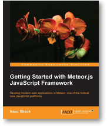

---
authors:
- max
blog: maxrohde.com
categories:
- javascript
date: "2013-03-26"
tags:
- programming
- review
title: Getting Started with Meteor.js (Review)
---

## Overall

The book [Getting Started with Meteor.js JavaScript Framework](http://www.packtpub.com/getting-started-with-meteor-javascript-framework/book) by [Isaac Strack](https://twitter.com/istrack) provides a **valuable resource to complement the online documentation** for the [Meteor.js](http://meteor.com/) framework. It features plenty of examples and integrates these into one comprehensive scenario; the implementation of a simple lending library. I would have loved to see some more background and advice on how to build large applications with Meteor and some patterns/solutions for common architectural level problems. But, hey, it's not like there [are hundreds of books](http://www.amazon.com/s/ref=nb_sb_noss_1?url=search-alias%3Daps&field-keywords=meteor.js) out there on Meteor.js so these issues might be something for a sequel!

## Background

[Meteor.js](http://meteor.com/) is an emerging JavaScript framework which aims to simplify communication between application servers and JavaScript clients.

Traditionally, we would deploy some form of RESTful service (or SOAP, for the brave) on the server, which is then consumed through AJAX calls from the JavaScript application. Thus, we end up with two idiosyncratic applications: one for the server and one for the client. Often, these two applications would be implemented using different languages; such as Java or C# on the server-side and, naturally, JavaScript for the client side. As a more recent development, [node.js](http://nodejs.org/) is employed to remedy some of the difficulties arising from this arrangement by allowing both the client and the server to be implemented using one language: JavaScript.

Meteor, building on node.js, goes one step further than the common node.js application and allows **JavaScript clients direct access to the application database** (a [MongoDB](http://www.mongodb.org/) database, to be precise). Since JavaScript clients should sensibly not be given full authorization to the database, privileged database operations can be performed by JavaScript scripts applications running on the server. Meteor allows to write both client-code and privileged code in one JavaScript file and takes care that only appropriate code is available to the client.

**Meteor is thus quite different to the traditional way of building web applications**. As such, some problems which we came used to expect cease to be of relevance, while new and different problems might come to the fore. Thus, when reading the book [Getting Started with Meteor.js JavaScript Framework](http://www.packtpub.com/getting-started-with-meteor-javascript-framework/book) by [Isaac Strack](https://twitter.com/istrack), my prime interest was in the following two points:

- Does the book serve as useful manual for navigating the basics of Meteor.js? and
- Does the book point to possible medium-term to long-term problems and provides pattern/solutions of dealing with these.

## Navigating the Basics of Meteor.js

The book definitely gives a good foundation to start using Meteor.js and overcoming various roadblocks one might encounter. This ranges from the very basics covered in chapter 1 'Setup and Installation' (note, the book covers only setup and installation for Linux and Mac and not the new [deployment for windows](http://win.meteor.com/)) to more elaborate questions discussed for instance in chapters 4 'Templates' and chapter 7 'Packaging and Deploying'. Everything is explained clearly and concisely with lots of practical advice, links pointing to further resources, plenty of code examples and additional background explanations.

I especially like that the chapters 2 to 7 explore an exhaustive example of building a Meteor application, a simple lending library:

> Using Meteor, we're going to build a Lending Library. We'll keep track of all our stuff, and who we lent it to, so that the next time we can't remember where we put our linear compression wrench, we can simply look up who we last lent it to, and go get it back from them.

This application is brought up to a fairly sophisticated level, adding database persistence and support for multiple users including login screen etc!

## Problems, Patterns and Solutions

The book does a very good job at explaining the motivation and benefits of the Meteor platform in chapter 3 accordingly named 'Why Meteor Rocks!'. This chapter in particular explores the benefits of the [MVVM](http://en.wikipedia.org/wiki/Model_View_ViewModel) (Model View View-Model) enabled by Meteor. However, there is little information on what kind of medium-term or long-term issues might arise in developing an application for Meteor.js and how these could be mitigated, for instance in form of [design pattern](http://www.citeulike.org/user/mxro/author/Gamma). But, then, the very title of the book focusses on '**_Getting Started_** with Meteor.js' so I guess it's fair enough if these more abstract and complex issues are omitted.

## Overall

See above!

_Disclaimer: I've created Appjangle, which some might say is similar to Meteor.js. However, I would disagree, since Appjangle is more of a cloud platform and focusses on supporting Java and JavaScript, while Meteor is a more of a framework with a strong focus on JavaScript. In any case, I think Meteor is great and thus consider my judgment unblemished J. Further, thanks to Packt Publishing for a free copy of this book!_
