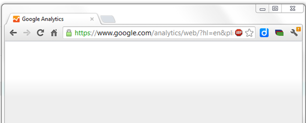
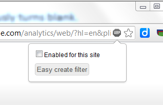

## The Problem

You can load the page [http://www.google.com/analytics/](http://www.google.com/analytics/) without any problem but when you click on \[Sign In\] the following happens:

A yellow bar appears briefly on the screen before it unceremoniously turns blank.

## Solution

This problem appears to be caused by the popular Chrome plugin [Ad Block Plus](https://chrome.google.com/webstore/detail/adblock-plus/cfhdojbkjhnklbpkdaibdccddilifddb?hl=en). When the empty page is loaded, a small red stop sign with the text ABP should appear next to the URL.

Click this red stop and deselect the check box 'Enabled for this site' as shown below:

## Links

Also check the Google Groups discussion '[Analytics won't load](http://productforums.google.com/forum/)'
