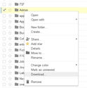
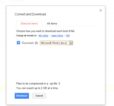
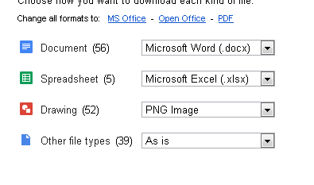

---
authors:
- max
blog: maxrohde.com
date: "2013-05-24"
title: Bulk Convert Google Docs Files to Microsoft Word
---

## Background

Word is evil, is it not? Shouldn't we be converting files away from Microsoft's vile format into the open web world of Google Docs? Maybe so.

But is Google Docs really that open? How many applications are there which allow us to VIEW and EDIT Google Docs documents - particularly applications not made by Google? Not very many.

I would like to ascertain to be able to access my documents in 20 years' time. Unfortunately, I do not know what kind of services Google will offer in the future and which services they will [discontinue](http://en.wikipedia.org/wiki/List_of_Google_products). On the other hand, there are dozens of applications today by dozens of vendors which support Microsoft Word files. Somehow I feel having my documents readily available as Microsoft Word files is the safer bet to achieve the goal of having these documents available in an uncertain future.

Thus, I decided to convert all my Google documents into Microsoft Word files.

## Solution

Luckily, this was not all too difficult using the [folder export feature](http://support.google.com/drive/bin/answer.py?hl=en&answer=2423534) of Google Drive. I used the following process:

1. Right click a folder which contains Google Documents.
2. Select the option 'Download'

1. The 'Convert and Download' dialog will open. Assure that documents will be exported as Microsoft Word files.
2. Click \[Download\]

1. After a short moment, the download of a ZIP file will start.
2. Unpack the ZIP file after it has been downloaded and voilà! All Google Documents will have been converted into Microsoft Word files.

## Potential Problems

Other file types contained in the folder might not be as easy to export in the same way. For instance, Google Drawings cannot easily be converted into a 'standard' format. Also, the quality of exports for Google Spreadsheets and Presentations is often worse than for text documents.

## References

[Google Docs Batch Export](http://googlesystem.blogspot.co.nz/2009/10/export-google-docs.html)