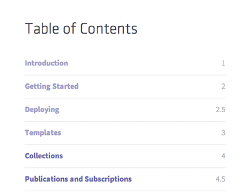
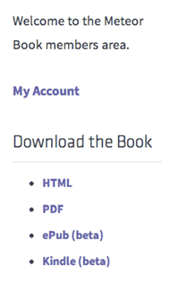
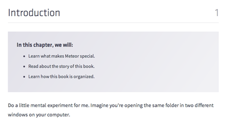
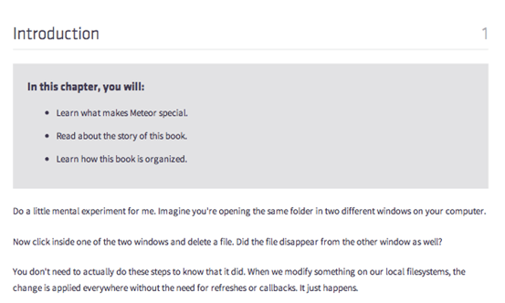
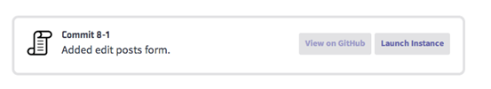
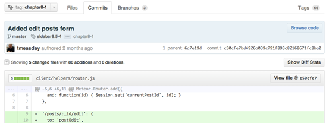
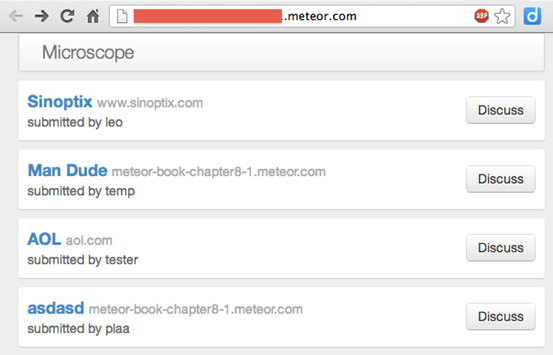
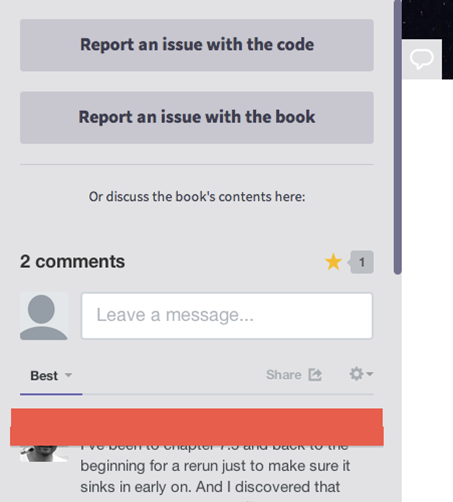

---
categories:
- javascript
date: "2013-05-24"
blog: maxrohde.com
tags:
- review
title: Looking Inside ‘Discover Meteor’
---

Do you want to see the future of book publishing?

'[Discover Meteor](http://www.discovermeteor.com/)' is an interactive book recently released by [Tom Coleman](https://twitter.com/tmeasday) and [Sacha Greif](http://www.sachagreif.com/) about the [Meteor JavaScript framework](http://meteor.com/). And it's a book as dynamic as the framework it describes.

In this post, I provide a few impressions of this book in form of screenshots and hope these give you a good idea of what to expect when purchasing Discover Meteor.

There is a **brief conclusion** at the end of this post as well.

### Impressions

**Impression 1**: The main entry point to the book is a web page, which shows the table of contents of the book. Clicking on any of the links will open the respective chapter as a web page.

**Impression 2**: Apart from browsing the book online, you can also download HTML, PDF, epub and Kindle versions.

**Impression 3**: The web version of the book is nicely formatted and easy to read. Each chapter starts with a quick summary.

**Impression 4**: The chapters look very similar in the rendered PDF version.

**Impression 5**: There are plenty of source code examples. Each example offers a link to a git tag and a live instance of a Meteor application using the example.

**Impression 6**: Below the linked page of git and the associated live instance from the example above.

**Impression 7**: Each chapter has an associated discussion thread. Many threads are quite lively and the authors provide help if needed.

### A Quick Conclusion

Discover Meteor seems like a great resource to get started using Meteor. The book is very applied. Every two or three paragraphs there will be a source code example, which drives the development of the example application pursued throughout the book ('Microscope') forward.

This is a book about solving problems with code. So, don't expect philosophical discussions of issues, which might arise while building a Meteor application. Nonetheless, 'Discover Meteor' will surely allow you to discover Meteor and learn to solve many common problems effectively and quickly by following the example solutions provided in the book.

Most impressive for me was the presentation of this book. This is not your usual reading experience, this is web reading. The book is made to be opened alongside your development tools and provides an interactive experience for **working** your way through the examples. On the downside, this is not a book to be enjoyed as part of a poolside techbook session. But that's not too bad, I think - more time to play with the kids instead.

_Disclaimer_: Thanks to [Sasha](https://twitter.com/SachaGreif) for access to the book.