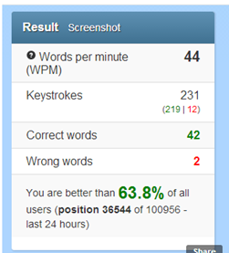

## Background

Skills are in demand. Presentation skills, communication skills, leadership skills! Without a doubt, you cannot have enough of these. Unfortunately, we often forget about the little and less-glamorous skills, which underlie these high-value skills. Spelling? Grammar? Typing? What small-minded people would care about these?

I didn't until a read a little book called '[Mastery](<http://en.wikipedia.org/wiki/Mastery_(book)>)' by Robert Greene in which a distinction is made between soft skills and hard skills. Soft skills are the high value skills such as leadership, communication or having a good strategy during a tennis match. Hard skills are the 'smaller' skills such as being able to use a computer mouse, hitting the forehand just right or typing fast on the computer keyboard. Greene claims that we don't pay enough attention to these hard skills and instead focus too much on the soft skills. That's a pity, since hard skills are so much easier to train for and improve than soft skills.

Anyway, learning about these soft and hard skills and being shown my own preference to focus on hard rather than soft skills motivated me to seek to improve some of my 'hard skills'. I chose to begin with touch typing. I always thought I was a faster typer, and probably I'm faster than the average by merit of hacking on the keyboard for a large part of the day. However, I did not use any touch typing technique but used my very own system, which involved a lot of finger-flying on the keyboard. Then, my partner crushed me in a [typing speed test](http://10fastfingers.com/) (90 wmp (she), 40 wmp (me)) which shattered my believe in my typing abilities.

In the past month, I have taught myself the basics of touch typing and now type using this technique round about as fast as I typed with my very own system before. There are plenty of free web applications out there, which teach the basics of touch typing. I used [typingstudy.com](http://www.typingstudy.com/) and [typingweb.com](http://www.typingweb.com/). [Typingclub.com](http://typingclub.com/typing-qwerty-en.html) also doesn't look too bad but I didn't use it so far.

## Dimensions of an Ideal Tool

While these tools are great to teach the basics of touch typing, I am a little bit disappointed by their ability to provide customized training for the intermediate typist such as myself. I would like a tool, which trains me personally, helps me to focus precisely on those areas, where additional training will be the most useful for me.

This led me to the search for a system that is not intended to teach touch typing but to help those who are already aware of the basics of touch typing to increase their typing speed. I looked a bit around and found tools such as [GNU typist](http://www.gnu.org/software/gtypist/) and many others, but they don't quite meet my requirements. Some thoughts I had about an 'ideal' systematic tool for improving typing speed are the following:

### A Nuanced Measure of Progress

There are two main parameters of importance for measuring typing speed. First, the words per minute, or more precisely, the keys per minute pressed. However, it is also important that the keys pressed are the right keys, since pressing any wrong key disrupts the flow of typing. An application is successful if it helps to increase both the raw speed of typing as well as decreases the errors made while typing.

### Trains the Right Words

Some words will be easier to type for some people than for others, while some words might be difficult to type for all. Usually, words containing less common characters such as x and z are more difficult to type than words made up of common characters such as e, a and i.

There are multiple approaches to deal with this problem. First, one can create a text with an average distribution of characters and use this text to assess typing speed. In such a text, letters like e will appear far more frequently than letters like x and z. The advantage of such a text is that it helps to emulate 'real-life' typing.

However, the disadvantage of this approach is that training to write such a text focusses on the frequently used letters of the alphabet – which, by all likelihood, the typist can already type rather well. So another approach would be to create texts containing characters, which are usually more difficult to type, or characters that a particular user has problems with. The obvious advantage of this approach is that it helps to train the 'problem keys' while spending less time on the common characters, we type a lot anyway.

### Distinguishes between Spelling and Typing Errors

A further issue that needs to be considered is that sometimes a wrongly pressed key might not signify a typing error but rather a spelling error. Usually, words that are difficult to spell should be slower to type. Also, words which we type frequently such as the, that, an, a, etc. should be faster to type than words we use infrequently (such as infrequently). These are additional effects in consideration of assessing typing speed, apart from the characters, which are contained in a word. Also, the length of a word might be a factor, with long words taking longer to type than short words, even when measuring not the time taken to type the entire word but rather the time taken per character of the word.

### Trains the Right Pairs and Groups of Characters

I have already talked about two important units in understanding typing better: the first obvious being the letters of the alphabet, each being associated with its own key. The second one being words. When letters and keys are the mechanical part of typing, words, in my mind, are the human part. Since through words we compose and understand language, rather than through characters? (We usually don't read every character in a word and attempt to decode their phonetic meanings but rather scan and understand the word as a whole; as long as it's a known word for us).

In order to understand and measure the way we type better, we can add intermediary units between letters and words, such as pairs of letters or triplets of letters. This, I think, makes a lot of sense, since some combination of keys might in general be easier to type than others; the easiest instance being the same letter appearing twice in a row, such as t in letter. Other combinations might be more difficult to type such as x followed by c as in exercise. Here again, we are probably faster and more precise in typing common combinations of letters, such as er than uncommon combinations. Also, triplets of characters or even larger groups could be of significance. For instance, exercise is almost entirely typed by the two middle fingers of the left hand, which might make it more difficult to type than a word, whose letters are easily distributed among the fingers of the left and right hand.

## Last Thoughts

The various factors discussed above taken together can easily affect the typing speed by 50% or more. That is, one typist can type a text of the same length in half the time if the text is composed of easy to type words rather than hard to type words. So, what would be the 'real' typing speed of any one typist? Is it the speed to write an easy, average or hard to type text, or the combination thereof? Also, what influence should the rate of errors have on the typing speed? Should an error reduce the typing speed by the time it takes to undo the error and retype the word? In this scenario, a test could block the completion of a sentence or word, if it is mistyped. Or would it be possible to calculate a penalty for mistyped words in terms of words per minute. And would it be possible to separate between spelling errors and typing errors?

Why are all these questions of importance? One key aspect, in my mind, of training any skill is that it is really difficult to train the skill if you cannot measure your progress. It is not impossible, after all, usually by doing something more we get better at it; it is just so much more effective if we have a good measure of our progress, since we can see if we are training right, and also it is a good motivation to be able to have a clear measure of your progress.

The danger is, of course, that if we measure things in a certain way, we tend to work towards what we are measuring rather than what is actually important for our skill. Therefore, it is of key importance to measure the right thing to assure to be training towards the right thing. Where is the tool that helps me do that?