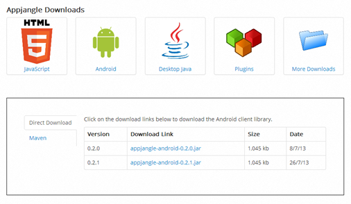

---
authors:
- max
blog: maxrohde.com
date: "2013-07-28"
title: Appjangle Java Client Libraries with Local Persistence
---

Appjangle has long supported Desktop Java, Android and JavaScript applications. However, with the most recent releases of client libraries (0.2.0 and 0.2.1) client libraries with more dedicated support for the Android and Desktop Java platform have been made available. Specifically, while before both Android and Desktop Java applications used the appjangle-java client libraries, now Android applications can use the [appjange-android](http://appjangle.com/downloads) client libraries and Desktop Java applications can use the [appjangle-jre](http://appjangle.com/downloads) client libraries.

Both the dedicated libraries for Android and Desktop Java come with built in support for persisting all [data replicated from the Appjangle cloud](http://nextweb.io/docs/nextweb-architecture.value.html) in a local database. This assures that any item of data downloaded from the Appjangle cloud is downloaded only once from the Appjangle cloud, even after a restart of the client application. This can increase the performance of some applications drastically since many server-round trips can be omitted. Of course, when a node is updated on the Appjangle cloud, the local replication can easily be updated using the [reload operation](http://nextweb.io/docs/nextweb-reload.value.html).

The Android client libraries are built with the [androidpersistence plugin](https://bitbucket.org/zedvoid/androidpersistence) in developed by [zedvoid](https://bitbucket.org/zedvoid/androidpersistence). This plugin uses an embedded SQLite database to persist the replication data. More information on using local replication on Android can be found in the [documentation](http://appjangle.com/build).

The Java client libraries currently persist the replication data as files and folders. Later, we might add a way to persist data though a JDBC connection as well. More information on using data replication for the Java client libraries can be found on the [Java documentation page](http://appjangle.com/build).