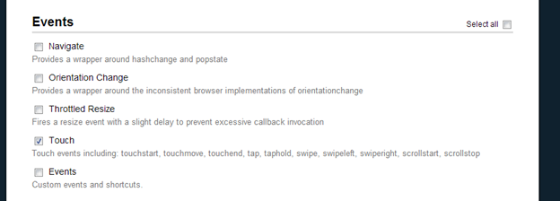

---
categories:
- javascript
date: "2013-09-04"
primaryBlog: maxrohde.com
tags:
- jquery
- mobile
title: Touch and Click in jQuery (without jQuery Mobile)
---

### Problem

One of the most common things I do with JQuery is to attach click event listeners to buttons, links and other elements as follows:

$(".class").click(function(evt) {});

Unfortunately, I found that, while this approach works well for Desktop browsers, the user interaction on touch-enabled devices feels very awkward and sluggish.

### Solution

Since this problem is of relevance for every mobile web application, numerous solutions have been proposed. All mobile UI JavaScript frameworks I know of provide built in support for 'tab' events, as opposed to 'click' events.

However, often we would just like to support being able to interact with simple buttons on our page regardless of whether a user accesses the site through a desktop or mobile browser; ideally, without adding another more or less 'heavy' framework to our site.

Luckily, jQuery Mobile is built in a very modular way and we can extract the particular component of the framework to support good support for tabs and clicks. Head to [http://jquerymobile.com/download-builder/](http://jquerymobile.com/download-builder/) and only check the 'Touch' component under Events.

Then, let the jQuery Mobile site build your download and add it to your page. For a quick test, you can also use the script provided below.

Next, we can rewire all calls to $(…).click() using the following snippet:

Now, when you register an event listener in your app using $(…).click(), the respective element should be pleasant to use for both desktop and mobile users.

## References

[The Current State of (Touch) Events](http://blogs.adobe.com/adobeandjquery/2011/03/07/the-current-state-of-touch-events/)

[Tap vs. Click: Death by Ignorance](https://coderwall.com/p/bdxjzg)