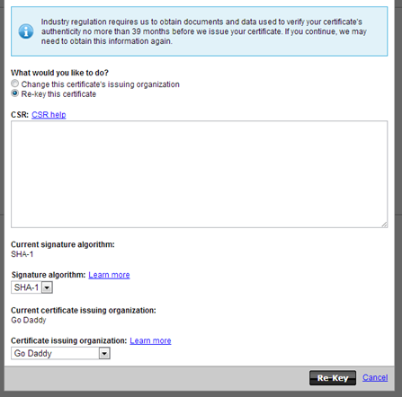
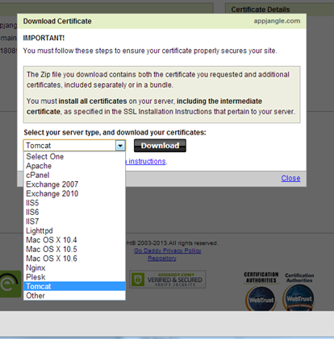
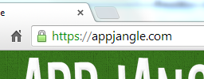

---
authors:
- max
blog: maxrohde.com
categories:
- java
date: "2013-09-06"
tags:
- netty
- ssl
title: Setting Up SSL with Netty
---

[SSL](http://en.wikipedia.org/wiki/Secure_Socket_Layer) is unquestionably a very useful and powerful technology to make systems more secure. Java in general and [Netty](http://netty.io/) in specific provide strong out-of-box support for supporting SSL encryption and authentication. However, since SSL is a complex technology it can often be cumbersome and difficult to set it up **correctly**.

The following steps describe how an SSL certificate can be obtained and configured to be used in Netty.

### Step 1: Create a Keystore

Create a keystore using Java's keytool (it's in the \[path to java\]/bin directory if it's not on your classpath):

`keytool -keysize 2048 -genkey -alias tomcat -keyalg RSA -keystore tomcat.keystore`

### Step 2: Create a Certificate Signing Request (CSR)

You need to generate this request to submit it to whichever party you would like to issue your SSL certificate (e.g GoDaddy or StartSSL). Again, use Java's keytool:

`keytool -certreq -keyalg RSA -alias tomcat -file yourdomain.csr -keystore tomcat.keystore`

### Step 3: Upload Certificate Singing Request to Issuer

Go to your issuer's website and upload the CSR where possible. For GoDaddy, the necessary form looks as follows:

Just copy and paste the contents from the yourdomain.csr file.



### Step 4: Download Certificate from your Provider

Download the certificate from your provided/issuer. For instance, for godaddy.com, select the certificate for Tomcat.



### Step 5: Installing the Certificates into your Keystore

You will need to install both the certificate for your server as well as some certificates from your issuer (see [intermediary certificates](http://kb.wisc.edu/page.php?id=18923)).

Below we will install the certificates provided from GoDaddy. First, install the root [certificates from GoDaddy](https://certs.godaddy.com/anonymous/repository.pki) into your keystore (the names for the crt files are different for different providers).

`keytool -import -alias root -keystore tomcat.keystore -trustcacerts –file gd_bundle.crt`

Then, install the intermediary certificates:

`keytool -import -alias intermed -keystore tomcat.keystore -trustcacerts –file gd_intermediate.crt`

The tool might prompt you that the "Certificate already exists in keystore under alias <root>". Type "yes" to add it in any case.

Lastly, install the certificate for your server:

`keytool -import -alias tomcat -keystore tomcat.keystore -trustcacerts –file yourdomain.com`

This time, the tool should report "Certificate reply was installed in keystore".

The result of this procedure should be that the tomcat.keystore file should have grown in size to about 8 kb (from 3 kb after step 2).

Optional: Also download the '[Go Daddy Class 2 Certification Authority Root Certificate](https://certs.godaddy.com/anonymous/repository.pki)' from the godaddy website and add it to your store. Add it with the alias 'root2'.

### Step 6: Double-Check you have Installed all Certificates

Use to keytool to verify that you have all certificates installed correctly.

`keytool –list –keystore tomcat.keystore`

This should show you that your keystore contains three entries: 'root', 'intermed' and 'tomcat'. (And 'root2' if you have added the Go Daddy Class2 certificate).

### Step 7: Prepare Keystore for Netty

There are many ways to provide the keystore we have just create to Netty. The following is just one option (but one I find particularly handy):

**1\. Convert your keystore into a String using [Base64Coder](www.%20source-code.biz/base64coder/java) and the [OneUtils](https://github.com/mxro/oneUtils).**

```java

final File original = new File(pathtoyourkeystore);

System.out.println(Base64Coder.encode(

OneUtilsJre.toByteArray(new FileInputStream(original))));
```

**2\. Copy the String and place it into a static variable, for instance:**

```java

class MyKeystore {

public static data = "[generated base 64 data]";

}
```

**3\. Create an [SSLContext](http://docs.oracle.com/javase/7/docs/api/javax/net/ssl/SSLContext.html) from the data of your keystore.**

```java

SSLContext serverContext = SSLContext.getInstance("TLS");

final KeyStore ks = KeyStore.getInstance("JKS");

ks.load(new ByteArrayInputStream(Base64Coder

.decode(MyKeystore.data)),

"yourkeystorepassword".toCharArray());

final KeyManagerFactory kmf = KeyManagerFactory

.getInstance(algorithm);

kmf.init(ks, "yourkeystorepassword".toCharArray());

serverContext.init(kmf.getKeyManagers(), null, null);
```

**4\. Create a Netty [SSLHandler](http://docs.jboss.org/netty/3.2/api/org/jboss/netty/handler/ssl/SslHandler.html) from the created context:**

```java
final SslHandler sslHandler = new SslHandler(serverContext);
```

**5\. Add the SSL handler to your [Netty pipe](http://seeallhearall.blogspot.co.nz/2012/05/netty-tutorial-part-1-introduction-to.html) (remember this must be the first handler):**

```java
pipeline.addLast("ssl", sslHandler);
```

Now deploy to server and enjoy the SSL security.



### References

[Generating a CSR and Installing an SSL Certificate in Tomcat 4.x/5.x/6.x](http://support.godaddy.com/help/article/5239/generating-a-csr-and-installing-an-ssl-certificate-in-tomcat-4x5x6x)

[Tomcat 5 SSL – Install GoDaddy Wildcard Certificate JKS / PKCS12 ? What?](http://ecxsystems.com/blog/2011/02/tomcat-5-ssl-install-godaddy-wildcard-certificate-jks-pkcs12-what/)

[Eclipse Wiki - Generating a Private Key and a Keystore](http://wiki.eclipse.org/Generating_a_Private_Key_and_a_Keystore)