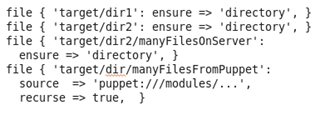

## The Problem

[Puppet](http://en.wikipedia.org/wiki/Puppet_(software)) allows deploying a structure of directories and files conveniently using the [file resource](http://docs.puppetlabs.com/references/latest/type.html).

Using the attributes 'source => …' and 'recurse => true', it is possible to create a copy of a set of files stored in the puppet module on target servers.

Unfortunately, using these attributes can slow down puppet significantly when the **target directory on the server contains many files**.

In my case, the time it took to apply a catalog jumped from under 5 seconds to more than 300 s.

## The Solution

If you are lucky, the related puppet bug [#9671](http://projects.puppetlabs.com/issues/9671) is closed in your version of puppet (not as of time of this writing).

If not, I found the following strategy to be effective:

- Replicate your base directory structure using plain file resources (without recurse => true).
- For subdirectories, do either:
    
    - Create a resource using 'recurse => true', for directories which contain many files/subdirectories in your puppet project.
    - Create more plain file resources for directories, which contain many files on the server.

Using this strategy, I was able to reduce the time to apply mentioned catalog below 10 s, while maintaining most of the convenience offered by the 'recurse' attribute.
