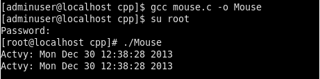

---
authors:
- max
blog: maxrohde.com
categories:
- linux
date: "2013-12-30"
title: Logging Mouse Events in Linux
---

**Problem**

You would like to obtain statistics about how often the mouse is used on a Linux machine.

**Solution**

Linux logs all activity of input devices (such as mouse and keyboard) into various [device files](http://en.wikipedia.org/wiki/Device_file) under /dev/input/\*.

Mouse activities, in particular, are logged in /dev/input/mice (this logs events for all mice attached). Hooking into this device file allows to be notified of all mouse events. The following C++ snippet reads the /dev/input/mice file and writes a simple log for the observed activity:

```cpp
#include <stdio.h>
#include <stdlib.h>
#include <fcntl.h>
#include <time.h>
#include <linux/input.h>

#define MOUSEFILE "/dev/input/mice"

int main()
{
 int fd;
 struct input_event ie;

 if((fd = open(MOUSEFILE, O_RDONLY)) == -1) {
 perror("Cannot access mouse device");
 exit(EXIT_FAILURE);
 }

while(read(fd, &ie, sizeof(struct input_event))) {
 time_t rawtime;
 struct tm * timeinfo;

time ( &rawtime );
 timeinfo = localtime ( &rawtime );
 printf ( "Actvy: %s", asctime (timeinfo) );
 }

return 0;
}
```

Safe the source code into a file mouse.c and compile this application using the following command:

```
gcc mouse.c -o LogMouse
```

You can run the compiled program as follows to log mouse events from your system in a text file:

```
./LogMouse > mouse.txt
```

Note: You will probably need root privileges to run this application, so use sodu or su.

[](http://nexnet.files.wordpress.com/2013/12/mouse.png)

**Resources**

[StackOverflow - How to read low level mouse click position in linux](http://stackoverflow.com/questions/11519759/how-to-read-low-level-mouse-click-position-in-linux)
