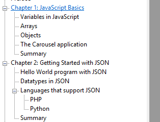

'[JavaScript and JSON Essentials](http://www.packtpub.com/javascript-and-json-essentials/book?utm_source=Create.com&utm_medium=link&utm_campaign=JSON)' by Packt publishing is a hands-on guide to developing JavaScript/PHP based web applications while using the JSON data format. This review of the book contains a quick summary of the contents as well as points to consider if you think of purchasing the book.

Overall, this as an easy to read book suited for novices in web development, packed with examples and easy to follow step-by-step instructions. However, advanced JavaScript developers will be familiar with most of the concepts covered in the book.

## Contents

### Chapter 1: JavaScript Basics

Explains the very basics of JavaScript, such as how to embed a script in a webpage, simple expressions (3+4), arrays and objects.

### Chapter 2: Getting Started with JSON

Goes through the fundamental rules of JSON documents and how to access the data they contain in JavaScript applications.

### Chapter 3: Working with Real-time JSON

Goes through an example of processing a complex JSON document, a collection of employees with their personal and employment details. Specifically, to query data from the document such as retrieving the positions of employees and to modify data.

### Chapter 4: AJAX Calls with JSON Data

Shows how to set up a simple web server under a Linux (LAMP) and Windows (ASP.NET) environment. Then, how to host a simple PHP script dynamically rendering JSON data and using XMLHttpRequest to access the data from this script from a JavaScript application.

### Chapter 5: Cross-domain Asynchronous Requests

This chapter firstly expands the PHP script and JavaScript application developed in the previous chapter. Specifically, by allowing to pass query parameters to the PHP script. Then, an example is shown how to load a JSON document through JSONP from the site reddit.

### Chapter 6: Building the Carousel Application

Shows how to develop a small example application in which student records are retrieved from a server and displayed in a web browser.

### Chapter 7: Alternate Implementations of JSON

Portrays numerous ways in which JSON data is used such as in PHP Composer and for Node.js package manager NPM. Briefly compares JSON with the data definition format YAML.

### Chapter 8: Debugging JSON

Introduces numerous tools that can aid in developing JavaScript applications such as Firebug and tools to validate (only syntax) and format JSON documents.

## The Good

- Provides a good introduction to developing simple applications with JavaScript and PHP which utilize JSON data.
- The book is overall well organized and it is easily understandable what is covered in the chapters.
- There are plenty of examples and step-by-step instructions
- The PDF version of the book is easy to navigate, with helpful bookmarks, which allow to browse the table of contents and hyperlinks throughout the document.

## Caveat Emptor

- Don't expect to become a grandmaster of JavaScript after reading the JavaScript intro of the book. It's around 14 pages and only meant to give a brief idea of JavaScript. If you are new to JavaScript, consider a complementary book such as [Object-Oriented JavaScript](http://www.packtpub.com/object-oriented-javascript/book) or [JavaScript The Good Parts](http://shop.oreilly.com/product/9780596517748.do).
- This book, as its title specifies covers the 'Essentials' of JavaScript and JSON. Thus it's a good starting point to become familiar with these technologies but does not contain more advanced or nuanced discussions, such as good design practices for JSON documents, performance issues or tradeoffs in using JSON.

Disclaimer: Thanks to [Packt Publishing](http://www.packtpub.com/) for providing a free review copy of this book!
