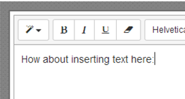

---
authors:
- max
blog: maxrohde.com
categories:
- javascript
date: "2014-03-28"
tags:
- bootstrap
title: Insert Text at Caret Position in Summernote Editor for Bootstrap
---

# Problem

Using the very useful [Summernote Editor](http://hackerwins.github.io/summernote) component for [Bootstrap](http://getbootstrap.com/), you would like to insert some text at the current caret position programmatically.



# Solution

The [Summernote API](http://hackerwins.github.io/summernote/features.html) does not provide any dedicated methods for inserting text. However, that's not a problem since we can use the JQuery/native DOM API to insert text into the editor. Thankfully, the content of the Summernote editor is nothing but vanilla HTML/DOM elements. Thus, we can insert text at the current cursor position as follows (if the Summernote editor is focused):

### To Insert at the End of the Current Paragraph

$(document.getSelection().anchorNode.parentNode).append("appended!");

### To Insert at the Current Cursor Position

```
var selection = document.getSelection();
var cursorPos = selection.anchorOffset;
var oldContent = selection.anchorNode.nodeValue;
var toInsert = "InsertMe!";
var newContent = oldContent.substring(0, cursorPos) + toInsert + oldContent.substring(cursorPos);
selection.anchorNode.nodeValue = newContent;
```

**Note**: You probably will have to work some magic with the document.getSelection() call. The problem is that once you would click a button or trigger the action in some other way, the selection would change. Thus, I save a reference to the document.getSelection() upon every focus and key press event on the editor.

### Insert at Current Position (Alternative)

As suggested by Dexter in the comments below, you can also insert text as follows:

```javascript

$(‘#summernote’).summernote('editor.saveRange');

// Editor loses selected range (e.g after blur)

$(‘#summernote’).summernote('editor.restoreRange');
$(‘#summernote’).summernote('editor.focus');
$(‘#summernote’).summernote('editor.insertText', 'This text should appear at the cursor');
```

## References

[MDN – Selection.anchorNode](https://developer.mozilla.org/en-US/docs/Web/API/Selection.anchorNode)

[Stackoverflow - Get caret position in contentEditable div](http://stackoverflow.com/questions/3972014/get-caret-position-in-contenteditable-div)

[Stackoverflow – Inserting Text at Cursor Position using JS/JQuery](http://stackoverflow.com/questions/1064089/inserting-a-text-where-cursor-is-using-javascript-jquery)

[Stackoverflow – JQuery Plugin for Inserting Text at Caret](http://stackoverflow.com/a/2819568/270662)