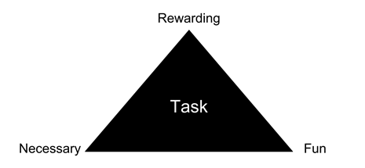

When it comes to organizing our lives, structured and logical approaches are in no short supply. Divide large projects into small tasks. Prioritize what is more important over what is less so. Identify the critical path of tasks leading most surely to success. All these are activities of the conscious and deliberate mind.

Some psychologist like to call this dimension of our mind [System 2](http://en.wikipedia.org/wiki/Dual_process_theory). System 2 takes care of conscious reasoning and helps us to think through things logically. As might be implied from the very designation of this system, there is a corresponding System 1. This system is generally responsible for subconscious and automatic activities of our brain; which helps us to drive cars and climb stairs without us having to 'think' about it explicitly. Some people also like to call these two aspects of our mind the _conscious_ and the _subconscious_ in a dramatic simplification of scientific terminology.

However, notwithstanding the terminology employed, System 1 and System 2 don't get very far without each other's help. If we would be consciously thinking about every action we have to take, we would move as fast as a computer from the 1960s rendering msn.com. If we wouldn't be consciously thinking about anything … well, no need to think too much about that.

It is concerning then that modern methodologies to organize our work rest firmly on the principles of system 2. Anybody who has employed these systems on any significant scale certainly can relate to the picture of being stuck moving at a speed which feels like it could be so much faster. System 1 is undoubtedly the system with more raw power; even if this power is often not directly available to us. However, there are various ways how we can harness the abilities of system 1 – especially if we speak its language of values and emotions.

Thus, I have a proposal here how we could bring a bit of System 1 into the way we organize our tasks. Specifically, I propose that for every task we need to undertake we assess the following three dimensions:

- **Necessity**: Does this task need to be done.
- **Reward**: Do I expect that completing this task will feel personally rewarding.
- **Fun**: Do I think it will be fun to complete this task.

Depressingly, I have little doubt that many of our To Do items will score heavy on the first dimension, necessity - while being less accentuated for the latter two. All the more reason to think carefully about these dimensions and asses their impact for our well-being and productivity.

## Necessity

If we do not do what needs to be done, we won't progress in life. Increasing the level of necessity of our tasks is an exercise in reduction. Cutting out the tasks which are really not that important to have more time for what really matters. There are many systems available to accomplish this, for instance the very popular [Getting Things Done](http://en.wikipedia.org/wiki/Getting_Things_Done).

## Reward

We all had these days were we are running around like crazy all day working on one important matter after the other. Only to be rewarded with the stale feeling at the end of the day that really we haven't accomplished anything at all. On the other hand, sometimes we do something small and seemingly unimportant – such as sending a short message to our loved one or finally sending off this message to Aunt Mary -, which leave us with a feeling of grand satisfaction with ourselves and our life. A lot of the research in the field of [Positive Psychology](http://en.wikipedia.org/wiki/Positive_psychology) has looked into the various aspects which moderate what leaves us feeling good and what doesn't.

To some degree it is our individual preferences which affect how rewarding a task feels. Is family the most important for you in your life? Then [picking up your daughter from school](http://transitionalmoment.wordpress.com/2013/01/25/i-pick-up-my-kids-late-from-school/) will certainly feel rewarding. Do want to become the most successfully [mergers and acquisitions](http://leadershipwatch-aadboot.com/2014/03/17/mergers-and-acquisitions/) lawyer in history. Then putting in another hour for the next big case will feel rewarding without a doubt. However, while we are usually quite good at figuring out which tasks will be necessary and which not when we put our mind to it (that is system 2, of course), we are often complete failures at figuring out what tasks will be [truly rewarding](http://ceridianblog.wordpress.com/2013/10/25/4-ways-that-employee-rewards-can-make-a-big-difference/). Also, just as necessity is not fixture and can change based on our goals, how rewarding something _feels_ is not unalterable. It depends to a large degree on our [_attitude_ towards the task](http://liesthatlimit.wordpress.com/2014/02/25/need-a-little-attitude-adjustment-at-work/).

Keeping this in mind, I have assembled a few rules of thumb to make the tasks we need to do more rewarding and to figure out ways to identify tasks which are rewarding:

- Do things [_for others_](http://www.marcandangel.com/2012/05/25/60-selfless-ways-to-pay-it-forward/).
- Attempt [difficult things](http://danwaldschmidt.com/2014/01/attitude/hard-things).
- Think about how a task relates to your life goals (Surely, there'll be some connection).

## Fun

We are usually quite good at indulging in things which are fun to do. Watching our favourite drama show with a good cold beer, go out drinking and bet on horse races, checking the latest gossip about Aunt Mary on Facebook - the opportunities are endless. Unfortunately, many activities linked to issues of greater import in our life, such as family chores and – behold – [_work_](http://enpjana.wordpress.com/2013/05/06/how-to-have-fun-at-work/), do not overlap with what we consider fun (the [exceptions](http://www.nytimes.com/2013/12/12/opinion/burkeman-are-we-having-fun-yet.html) proving the rule).

Unfortunately, we are not great experts in fun either (that is after passing into the second decade of existence). Since, often what we consider fun in the beginning [quickly turns into a habit](http://health.usnews.com/health-news/blogs/eat-run/2013/01/30/does-it-only-take-3-weeks-to-form-a-habit) – until we forgot why we started doing it to begin with (think watching television, drinking and betting on horse races and checking Facebook). Thankfully, how entertaining an activity is not only determined by _what_ we do but also by _how_ we do it. Clearing out the rain gutters just becomes this much more _fun_ if you do it with your best buddy while wearing [fish masks](http://www.alibaba.com/product-detail/Realistic-Animal-Full-Head-Mask-Party_1447627053.html).

Thus, here a preliminary short list of ideas how any tasks can become more fun.

- Do things _with others_.
- Do things differently or with [different tools](http://www.javacodegeeks.com/2014/04/do-not-underestimate-the-power-of-the-fun.html).
- Do new things.
- Do little things in a weird and stupid way.

You might have guessed the punchline of this article from its subtle title: Key to a successful organization of your tasks is to **maximize how necessary, rewarding and fun your tasks are**. This would assure you are [getting more done](http://lightarrow.com/best-practices-for-getting-things-done-prioritizing-tasks-in-lifetopix) while being [more productive](http://youngworkathomemoms.wordpress.com/2014/02/20/simple-fun-ways-to-increase-productivity/) and altogether [more happy](http://checkside.wordpress.com/2012/01/20/motivation-revamped-a-summary-of-daniel-h-pinks-new-theory-of-what-motivates-us/).

However, this is easier said than done. Thus, if we cannot find tasks that fall within each of these categories, at least we should try to have a healthy mix of tasks falling within the different categories. For instance, to assure that in a day or week, we have some tasks which are necessary but also some tasks which are fun and rewarding.
