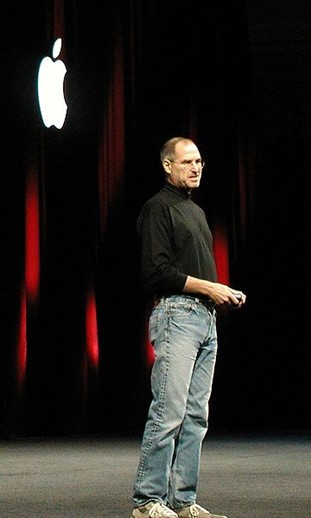

---
categories:
- leadership
date: "2014-05-06"
primaryBlog: maxrohde.com
tags:
- isaacson
- steve-jobs
title: Steve Jobs and Leadership
---

There is something wrong with the way Steve Jobs led people. The [biography](<http://en.wikipedia.org/wiki/Steve_Jobs_(book)>) from ‪Isaacson‬ is full of examples how Steve Jobs exercised excessive control, restricting the autonomy of talented employees, or outright abused employees in an inhumane way.

Research suggests that people work better if they are not driven by fear or monetary incentives but by a desire for autonomy and by the desire to become better at whatever they are doing.

Consequently, having a leader like Steve Jobs should be detrimental for any business, preventing employees to realize their full potential. However, it is difficult not to see that Steve Jobs was indeed good for Apple, leading it to unprecedented successes. This contradiction has puzzled me for a while: how can Jobs have exercised such bad leadership, yet be so successful. I think one possible answer might lie in that Jobs did some things outstandingly right, mitigating the effects of his bad leadership style. I think one of these things was that Jobs was a leader to inspire.

Jobs did not led his company through following a carefully justified strategic plan. He led his company through a number of strong visions, which resonated both in his personality as well as in his actions. Some of these visions were:

- building great products through simplicity, control over end-user experience, and great and delighting design (a product is not ready yet, if it does not surprise and delight)
- building a company which can last generations
- building a team exclusively made of top performers

I think this aspect of Jobs' persona is rather well known and documented. Jobs was a [man of the Why](http://www.newyorker.com/reporting/2011/11/14/111114fa_fact_gladwell?currentPage=all), the purpose behind what is done, rather than a man of the How, the way something is achieved. Visions are a powerful psychological instrument, connecting with people's feelings rather than their logical mind.

Although Jobs led successfully through visions, it should not be forgotten that visions can also be extremely harmful. Hitler was a very skilled leader, leading by grand visions and emotions rather than rational arguments - with well-known devastating outcomes. This is not to say, of course, that Steve Jobs was like Hitler, he certainly was a totally different person. However, I believe, as powerful as visions can be, they can also be dangerous.

James Collins in his book '[Good to Great](http://en.wikipedia.org/wiki/Good_to_great)' suggests that the research of his team into lastingly successful companies revealed that all of these companies were led by so called '[Level 5 Leaders](http://younglifeperception.wordpress.com/2012/10/22/are-you-a-level-5-leader/)'. These leaders, though highly successful, often shun publicity and always emphasize that it is their team driving the success of the company and not them. They are also very passionate about the success of their company. The main factor which distinguished these 'Level 5 Leaders' from celebrity CEOs in the data observed by Collins and his team was that companies of Level 5 Leaders continued to be successful after the leaders left.

Apart from an obvious lack of compassion, this could be another downside of Steve Jobs' leadership style. Will Apple prevail to be as successful as they have been with Jobs at the helm? In any case, however great a leader Jobs was, I do not think that he is a good role model for future leaders. Since, looking at the descriptions in ‪Isaacson‬'s biography, it appears that some of his success was built on compromising the dignity of subordinates; and dignity, in my point of view, is something that should never be compromised on no matter how 'great' the endeavour (as should be the [law](http://www.nytimes.com/2014/05/03/business/steve-jobs-a-genius-at-pushing-boundaries-too.html)).

Picture Credits: [http://en.wikipedia.org/wiki/File:Stevejobs_Macworld2005.jpg](http://en.wikipedia.org/wiki/File:Stevejobs_Macworld2005.jpg)