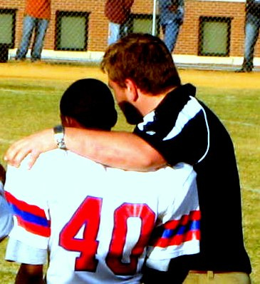

It might be that our subconscious mind ears often in our urban and large-scale world. It might be that reason and traditional intelligence are the most useful devices to navigate this world.

I'm reading ‘[Thinking Fast and Slow](http://en.wikipedia.org/wiki/Thinking,_Fast_and_Slow)’ from Kahneman at the moment and what I've read so far seems to have a bias towards our higher mind of reason. Specifically, various instances are discussed in which what humans intuitively feel is the correct answer is logically and/or mathematically false.

However I think it is better to think of our subconscious, automatic mind as a prodigy. Somebody with great potentials but also great flaws. It is our job to be the guide of this prodigy. Thereby not understanding our conscious, reasoning mind as being more trustworthy or superior to our subconscious mind, but understanding it as a facilitator, a manager. The conscious mi d is not the rock band, which amazes millions, it's the boring guy in the background, which assures that the catering is cared for.

Because our conscious mind is weak - it might give us the illusion that our reasoning mind is us - that we could be the voice talking in our had and deliberately going through the steps of calculating 34 \* 15 - but this voice is not who we actually are, it's a small, insignificant part of what constitutes us; our intuition, the thoughts and processes we are not aware of are much more us - importantly they set the boundaries of what our conscious mind can accomplish.

The conscious mind however can also work as a coach. It can observe the team, send it through drills and training sessions, set the strategy; however, when the real action happens, the conscious mind, just like a coach, stands on the side lines with very little influence.

A good or a bad trainer can make a crap team into a sterling one. But only a trainer, who accepts his team, and accepts his role in the periphery of the game can accomplish such.

Such I believe the conscious mind should progress, with humility, patience, love and determination.
