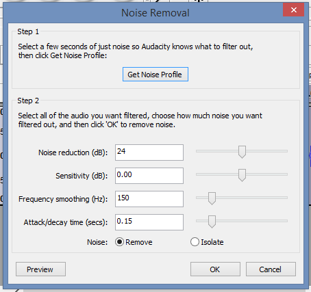
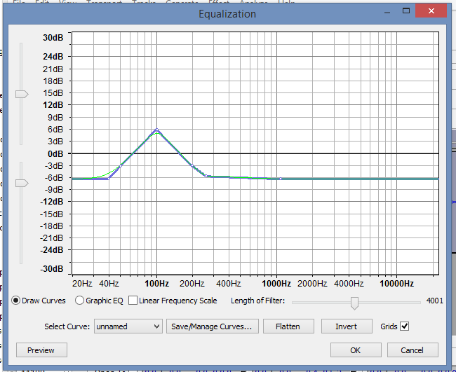
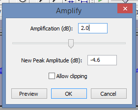

Audacity is a powerful and free tool to edit all kinds of audio files. However, the many features it offers can be overwhelming for beginners and more advanced users alike. This guide contains some tips how to go about doing a very specific task with audacity: **Improving the quality of recorded voice**, for instance for podcasts or voice overs.

This guide is especially meant for situations where you do not have a very good microphone and other professional recording equipment.

## Recording

Things to remember while recording:

- Hold the microphone close, but not so close that there will be cracking and/or overemphasized explosive sounds (such as when speaking the letter 'p').
- Try to find a small room with few flat and hard surfaces (such as a wall). Rooms with plenty of curtains and carpet are better.
- Try to find a place for recording which you will be able to access again (such as a room in your house). If you record yourself in a different location, your voice might sound noticeably different. WHERE you record is as important as HOW you record.
- Make sure that there are a few seconds of silence at the beginning and/or end of the recording.

After you have done the recording, post production in Audacity may commence.

## Remove Background Noise

- First, select 1 to 3 seconds of the silence at the beginning and/or end of the recording.
- Play the selection and assure that it is homogenous. That is, it contains hissing or other kinds of background noise, which does not change (e.g. gets louder or is interrupted by other noises such as clicking a mouse, breathing, etc.).
- Go to menu Effects / Noise Removal (keyboard shortcut: Alt + C à'N' à Enter)
- Configure the settings as follows (or play around with them for better results):

- Click on \[Get Noise Profile\] (keyboard shortcut: Alt + G).
- Select your whole recording (keyboard shortcut: Ctrl + A).
- Apply the noise removal by using menu Repeat Last Effect (keyboard shortcut: Ctrl + R).

Note: You might want to repeat this process once more while selecting another region of 'silence' – this can help to reduce the background noise even more.

## Make the Voice 'Warmer'

When using cheap microphones, your voice might often sound metallic. To remove this effect, apply this simple filter.

- Select your whole recording
- Go to menu Effect / Equalization
- Set up a curve as explained here [#1 Audacity Tutorial: Warm & Clear Voice](https://www.youtube.com/watch?v=yVN6DzMaVe4)

- Apply the effect

## Make the Recording Louder

Applying the previous effect will have made the recording overall less loud. You should now be able to amplify it to make it louder without causing distortions.

- Select the whole recording
- Go to menu Effect / Amplify
- Set the amplification to 2 db to 4 db (NOT as much as you can without causing cropping.

## And More

There are plenty of more effects you can apply to a voice recording, for instance, [compression](http://47leads.com/2-tips-dramatically-enhance-your-voice-recording-with-audacity/) or normalization. However, keep in mind that any effect that you add also reduces the quality of your sound file and makes it less authentic. So, only apply effects if you can hear they make a noticeably positive difference (without negative side effects).

Note that you can create an [Edit Chain](http://manual.audacityteam.org/o/man/edit_chains.html) for the equalization and amplification to apply the effects conveniently to many files. While you can use the Noise Filter in an edit chain as well, I would not recommend it, since there are often subtle differences in the background noise between recordings (even if they are recorded in the same room) and the Noise Filter can only apply one noise profile to all files which are to be processed.

## References

[How to Make Vocal Audio Sound Better in Audacity](http://www.lockergnome.com/media/2012/04/19/how-to-make-vocal-audio-sound-better-in-audacity/)

[#1 Audacity Tutorial: Warm & Clear Voice](https://www.youtube.com/watch?v=yVN6DzMaVe4)