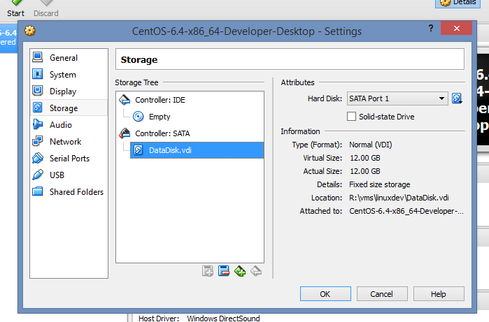

---
authors:
- max
blog: maxrohde.com
categories:
- linux
date: "2014-06-21"
tags:
- virtualbox
title: Convert Dynamically Sized VirtualBox VDI Hard Drive to Fixed Size
---

## The Problem

You have got a dynamically sized, VDI virtual hard drive in VirtualBox and would like to convert it into a fixed size hard drive.

You are using Windows.

## The Solution

- Locate VBoxManage.exe on your machine. It should be in the VirtualBox program directory (usually found under C:\\Program Files\\Oracle\\VirtualBox) .
- Open a command prompt (e.g. by searching for "cmd"+Enter Windows 7 or 8).
- Go to the directory in which VBoxManage.exe is located by typing something like:

cd "C:\\Program Files\\Oracle\\VirtualBox"

- Convert your dynamically sized hard drive to a fixed size harddrive using the command:

C:\\Program Files\\Oracle\\VirtualBox>VBoxManage.exe clonehd <path-to-source-vdi> <path-to-destination-vdi> --variant Fixed

This might take a while depending on the size of your drive. You probably have used this drive as part of a virtual machine. In order to use the new hard drive you need to go through a few more steps.

- Open the virtual box manager, go to settings for your machine and remove the old (dynamically sized) drive from the SATA controller for this machine.

- Go back to the command line and display a list of your currently registered hard drives:

VBoxManage.exe list hdds

- Manually remove your old drive from the list by running the command:

C:\\Program Files\\Oracle\\VirtualBox>vboxmanage closemedium disk <UUID of your drive> --delete

**ATTENTION**: This will delete your old hard drive file. You may want to make a backup copy of the image before running this operation.

- Rename the new (fixed size) hard drive file to the name of your original vdi file. For instance, if your old drive's name was 'myhdd-10GB.vdi' and your new fixed size drive's name is 'fixed-10GB.vdi', rename 'fixed-10GB.vdi' to 'myhdd-10GB.vdi'
- Go to the VirtualBox Manager and add the freshly renamed drive to the SATA controller for your VM.

Now you should be able to start your VM with the new drive and (hopefully) enjoy the performance benefits of a fixed size drive.

## References

[HOWTO: Convert VDIs Between Fixed-Sized and Dynamic In VirtualBox](http://brainwreckedtech.wordpress.com/2012/01/08/howto-convert-vdis-between-fixed-sized-and-dynamic-in-virtualbox/)

[Stackoverflow - Convert VirtualBox dynamic VDI disk image to static, fixed VDI](http://superuser.com/questions/437591/convert-virtualbox-dynamic-vdi-disk-image-to-static-fixed-vdi)

[coderwall - Purge deleted hard disks from Virtual Box](https://coderwall.com/p/8m--dq)
