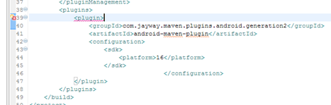
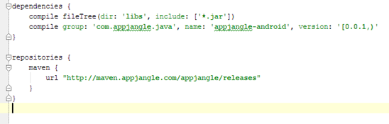

As of August 2014, **don't even try this**.

Officially, the [Google Eclipse plugin supports Eclipse 4.4 (Luna)](https://developers.google.com/eclipse/docs/download) at present. However, in order to be able to create projects which are both Maven projects and Android projects you will need to install the [m2e-android plugin](http://rgladwell.github.io/m2e-android/). This currently does not support eclipse Luna. Probably, if you create a new Android project based on the archetype suggested by the m2e-android plugin, you might get **errors** such as:

- …R cannot be resolved to a variable
- Plugin execution not covered by lifecycle configuration: com.jayway.maven.plugins.android.generation2:android-maven-plugin:3.8.2:generate-sources (execution: default-generate-sources, phase: generate-sources)
- Project configurator "me.gladwell.eclipse.m2e.android.androidDevelopmentToolsProjectConfigurator" is not available. To enable full functionality, install the project configurator and run Maven->Update Project Configuration.
- Plugin execution not covered by lifecycle configuration: com.jayway.maven.plugins.android.generation2:android-maven-plugin:3.8.2:proguard (execution: default-proguard, phase: process-classes)

My **recommendation** is to use [Android Studio](https://developer.android.com/sdk/installing/studio.html).

You can easily add Maven dependencies to projects in Android Studio. Just locate the 'build.gradle' file in your application directory and add a [compile dependency](http://www.gradle.org/docs/current/userguide/artifact_dependencies_tutorial.html).

