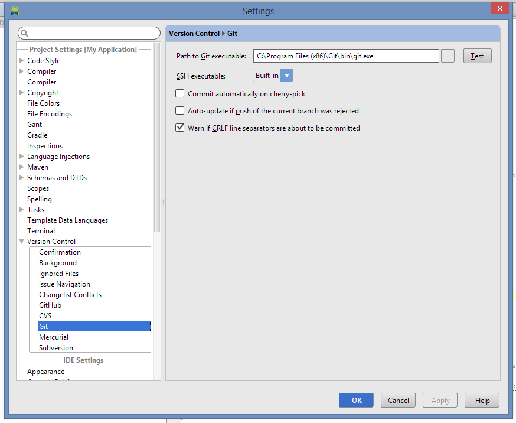
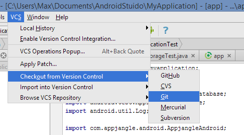
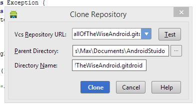
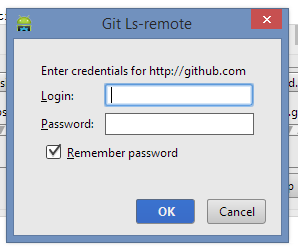

## Problem

You have an existing [GitHub](https://github.com/) project and would like to import it to [Android Studio](https://developer.android.com/sdk/installing/studio.html).

## Solution

Perform the following steps to import your project.

### Step 1: Install git for Windows

It can be downloaded for free from [git-scm.com](http://git-scm.com/downloads).

Most settings available during the installation process should be compatible with Android studio. Just choose the settings you deem the most appropriate.

### Step 2: Link git executable to Android Studio

Open Android Studio and got to Settings. In the Setting dialog open the page Version Control / Git. Here define the path to the git executable you have just installed.

### Step 3: Get the Path to your Repository from Github

Go to the GitHub page and get the HTTPs path to your repository. For instance:

https://github.com/mxro/WallOfTheWiseAndroid.git

### Step 4: Import the Git project to Android Studio

Go to Android Studio and go to Menu / VCS / Checkout from Version Control / Git

Paste the HTTPS path you obtained from GitHub in the previous step and click on \[Clone\].

Provide your GitHub username and password.

Now the project should be imported to Android Studio and you should be able to commit and push future changes back to GitHub.

## References

[Android Studio Git Tutorial (Part 1) « Wii's Blog](http://wii.logdown.com/posts/2013/11/15/android-studio-git-tutorial)

[github - How to clone a remote git repository with Android Studio? - Stack Overflow](http://stackoverflow.com/questions/16597092/how-to-clone-a-remote-git-repository-with-android-studio)

[Setup Android Developer Studio | devroyal.de](http://devroyal.de/setup-android-developer-studio/)
