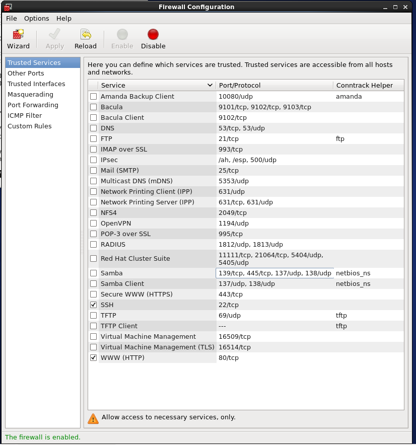
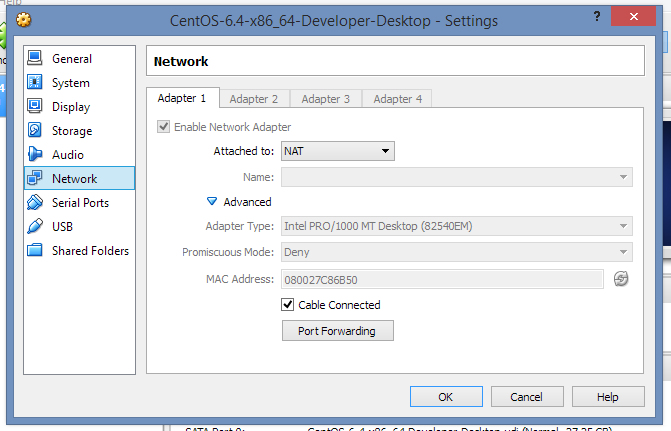
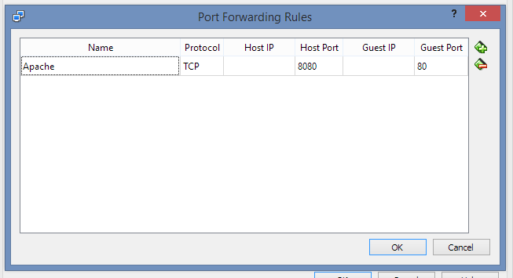

## Problem

You have a [RHEL](http://www.redhat.com/en/technologies/linux-platforms/enterprise-linux) or [CentOS](http://www.centos.org/) 6 [VirtualBox](https://www.virtualbox.org/) Virtual Machine and a Windows or other host and would like to access a web server on the VM from the Host OS.

## Solution

Assure that the [Apache Web Server](http://httpd.apache.org/) is available and started on the guest OS:

\`sudo httpd start\`

Assure that firewall allows the guest OS to handle web requests.

Type \` sudo system-config-firewall\` and enable the WWW service.

Configure port forwarding for the VM. Go to the VM settings in the Oracle VM VirtualBox Manager / Page 'Network'.

Click on the button \[Port Forwarding\] and add an entry such as the following:

Now, on your host OS, you should be able to see the Apache Server test page when opening \`http://localhost:8080\` in a browser.

## Troubleshooting

Since every system is configured differently there might be some problems you encounter. If you don't see the test page, you could try the following:

- Disable [SELinux](http://en.wikipedia.org/wiki/Security-Enhanced_Linux) by opening the file \` /etc/selinux/config\` and setting the configuration to \` SELINUX=disabled\` (see a more [detailed guide here](https://access.redhat.com/documentation/en-US/Red_Hat_Enterprise_Linux/6/html/Security-Enhanced_Linux/sect-Security-Enhanced_Linux-Working_with_SELinux-Enabling_and_Disabling_SELinux.html))
- This tutorial assumes that you use the default [NAT network adapter](http://www.virtualbox.org/manual/ch06.html) for you VM. If you use a 'host-only' or 'bridged' connection, the process will be a bit different.

## References

Stackoverflow - [How to SSH to a VirtualBox guest externally through a host?](http://stackoverflow.com/questions/5906441/how-to-ssh-to-a-virtualbox-guest-externally-through-a-host) Very helpful, also read the comments

Stackoverflow - [Apache restart causes DocumentRoot must be a directory, even though it is a directory and there seem to be no privilege issues](http://stackoverflow.com/questions/14786881/apache-restart-causes-documentroot-must-be-a-directory-even-though-it-is-a-dire)

CentOS Board - [Basic firewall config (just port 80 and ssh 22)](https://www.centos.org/forums/viewtopic.php?t=9026)
