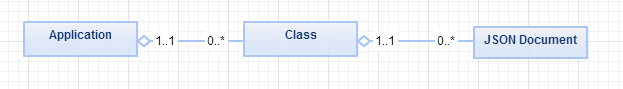
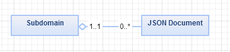
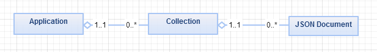
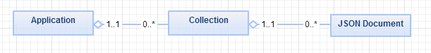
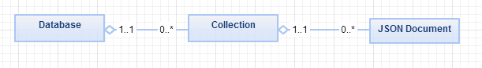

---
authors:
- max
blog: maxrohde.com
categories:
- java
- javascript
coverImage: 090914_0208_acomparison5.png
date: "2014-09-09"
tags:
- firebase
title: A Comparison of Data Models in BaaS (Backend-as-a-Service)
---

While Backed-as-a-Service (BaaS) - and their [stepbrothers PaaS](http://blog.cobia.net/cobiacomm/2013/03/15/paas-services-and-backend-as-a-service-baas/) - offerings should sensibly support various [domain-specific data models](http://lostechies.com/jimmybogard/2010/02/04/strengthening-your-domain-a-primer/) for the application they support, these services are inherently built on a 'meta' data model. This meta data model lays the constraints for all domain-specific data and should thus be an important consideration in selecting or not selecting a BaaS solution.

I have sifted through the documentation of five popular BaaS solutions and tried to uncover the fundamental model of data underlying these platforms. My findings are presented below.

# In a Nutshell

All examined solution but Firebase have a 'three-tier' data model where similar **JSON documents** are aggregated in **collections** or classes, which allow the effective querying of these documents. These collections of JSON documents in turn are aggregated in **databases** or per application. Some solutions provide additional mechanisms for defining connections between JSON documents (Parse, usergrid). Firebase features the most unique model; where all data is stored in one very big, hierarchical JSON document.

# Parse

Parse stores data internally [as flat JSON](https://parse.com/docs/data) Documents, called [ParseObject](https://parse.com/docs/android/api/com/parse/ParseObject.html), with have the restriction that keys [must be alphanumeric strings](https://parse.com/docs/android_guide). Parse automatically creates 'classes' for ParseObjects, grouping objects with similar properties. Classes and all objects associated to them belong to applications, which can be defined on the Parse web interface. In addition, Notably, Parse allows for various [types of relationships](https://parse.com/docs/relations_guide) between ParseObjects for one-to-many and many-to-many relationships.

# Firebase

[Firebase](https://www.firebase.com) stores data as [JSON documents](https://www.firebase.com/docs/how-firebase-works.html). Essentially, a data store in Firebase is one large JSON document. Data stores are associated with subdomains such as <my store>.firebase.com.

# Kinvey

Fundamentally, [Kinvey](http://www.kinvey.com/) stores data as collections and entities. Entities are essentially JSON documents. Collections belong to applications. Internally, data is stored in a MongoDB cluster.

# Apache usergrid\_

The [Apache usergrid\_](http://usergrid.incubator.apache.org/docs/relationships/) documentation did not make it easy to find out about the data model underlying the platform. I think the data is primarily stored as [JSON documents](https://github.com/apache/incubator-usergrid/blob/master/sdks/java/src/main/java/org/apache/usergrid/java/client/entities/Entity.java) named entities on the platform. These in turn (I think) are stored in [collections](http://usergrid.incubator.apache.org/docs/collections/). Collections themselves belong to [applications](http://usergrid.incubator.apache.org/docs/applications/). Notably, Apache usergrid has some support for graph-like data as [relationships between entities](http://usergrid.incubator.apache.org/docs/relationships/). Internally, Apache usergrid is based on [Cassandara](http://www.sinbadsoft.com/blog/cassandra-data-model-cheat-sheet/) and provides good support for relational/SQL type queries.

# BaasBox

Data in BaasBox is stored as [JSON documents](http://www.baasbox.com/documentation/?shell) called documents. These documents are grouped in [collections](http://www.baasbox.com/documentation/?shell). Collections are ultimately stored in [databases](http://www.baasbox.com/documentation/?shell). Since every BaasBox server represents one application, databases belong to the application [configured for the server](http://www.baasbox.com/documentation/?shell).

# References

## Parse

[ParseObject JavaDoc](https://parse.com/docs/android/api/com/parse/ParseObject.html)

[Parse JavaDoc](https://parse.com/docs/android/api/com/parse/Parse.html)

[Parse Documentation – Data & Security](https://parse.com/docs/data)

## Firebase

[Firebase – How It Works](https://www.firebase.com/how-it-works.html)

[Firebase – Understanding Data](https://www.firebase.com/docs/web/guide/understanding-data.html)

## Kinvey

[A backend's representation inside Kinvey](http://devcenter.kinvey.com/android/tutorials/look-behind-the-scene)

[Android – Data Store](http://devcenter.kinvey.com/android/guides/datastore)

## Apache usergrid\_

[Entity.java in usergrid Java client library](https://github.com/apache/incubator-usergrid/blob/master/sdks/java/src/main/java/org/apache/usergrid/java/client/entities/Entity.java)

[Apache usergrid Documentation](http://usergrid.incubator.apache.org/docs/collections/)

## BaasBox

[BaasDocument JavaDoc](http://baasbox.github.io/Android-SDK/docs/com/baasbox/android/BaasDocument.html)

[BaasBox Documentation – Database Management](http://www.baasbox.com/documentation/?shell)

UML Diagrams created with [creately.com](https://creately.com/).
