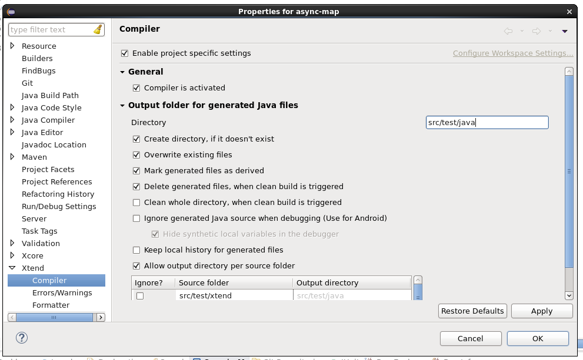
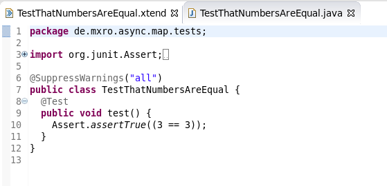

---
authors:
- max
blog: maxrohde.com
categories:
- java
date: "2014-09-13"
tags:
- eclipse
- maven
title: Setting Up Xtend with Maven and eclipse (Luna)
---

[Xtend](http://www.eclipse.org/xtend/) is currently my favourite alternative language for the JVM (closely followed by [Kotlin](http://kotlinlang.org/)). Unfortunately, I did not find a good guide of how to set up a Maven project within eclipse (Luna) which uses Xtend.

Specifically the following guide will allow you to allow you to write test cases in Xtend for your existing Java projects. A great way to get started with Xtend I suppose.

The following describes the necessary steps.

- Install the Xtend plugin for eclipse as described [here](http://www.eclipse.org/xtend/download.html).
- Add the xtend-maven-plugin to your pom.xml as follows:

```xml
<plugin>
    <groupId>org.eclipse.xtend</groupId>
    <artifactId>xtend-maven-plugin</artifactId>
    <version>2.7.1</version>
    <executions>
        <execution>
            <goals>
                <goal>testCompile</goal>
            </goals>

            <configuration>
                <testOutputDirectory>${basedir}/src/test/java</testOutputDirectory>
            </configuration>

        </execution>
    </executions>
</plugin> 
```

- Also add a dependency to the Xtend runtime libraries

```xml
<dependency>
    <groupId>org.eclipse.xtend</groupId>
    <artifactId>org.eclipse.xtend.lib</artifactId>
    <version>2.7.1</version>
    <scope>test</scope>
</dependency>
```

- Right click the project and select Maven / Update Project … and update the project.
- Right clock the project and select Properties
- Go to the Xtend / Compiler page
- Set as the ouput director src/test/java



- Go to the folder src/test/xtend. If the folder does not exist, create it.
- Right clock the folder src/test/xtend and select Build Path / Use As Source Folder
- Create a package in the new src/test/xtend folder and right click the package. Select New / Xtend class and define a class such as the following:

```java
package de.mxro.async.map.tests
 

import org.junit.Assert
import org.junit.Test
 

class TestThatNumbersAreEqual {
    
    @Test
    def void test() {
        Assert.assertTrue(3 == 3)
    }
    
    
}
```

- Immediately after you save the class a translated class should be created in the folder src/test/java



Now, have fun writing tests using Xtend's concise syntax – while not affecting any step of your build and development workflow!

To see an example configuration in a complete project, also check out [async-map on GitHub](https://github.com/mxro/async-map).
