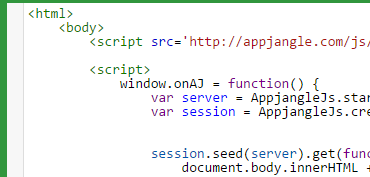

---
categories:
- javascript
date: "2014-09-24"
blog: maxrohde.com
title: CodeMirror 3 Indent All Lines / Autoformat
---

## Problem

You have created an instance of a [CodeMirror](http://codemirror.net/) and initialized it with some text and would like to correct its indentation or you would like to give the user the option to 'autoformat' the text entered.

## Solution

Iterate over all lines in the editor and indent them individually:

var e = CodeMirror.fromTextArea(textarea.get(0), {});

for (var i=0;i<e.lineCount();i++) { e.indentLine(i); }

This should indent all lines in your editor nicely:

Note that in CodeMirror 2 there was an [autoformatter add-in](http://codemirror.net/2/demo/formatting.html) which is not [officially supported for CodeMirror 3](http://codemirror.977696.n3.nabble.com/codemirror-3-0-format-preloaded-textarea-code-td4026907.html).