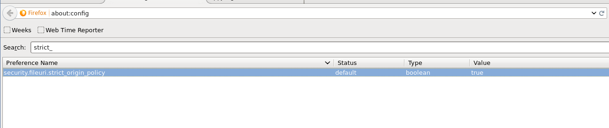

---
categories:
- javascript
date: "2014-10-03"
blog: maxrohde.com
title: Fix Firefox ‘Permission denied to access property document’
---

### Problem

You are trying to load a script from a local file into a page displayed in Firefox (as can sometimes be useful for testing).

Firefox reports an error such as

### Error: Permission denied to access property 'document'

### Error: Permission denied to access property 'local'

### Solution

This problem is caused by a security restriction that should normally be in place. However, you can temporarily disable this security feature as follows:

- Enter the address 'about:config' in your Firefox
- Search for 'strict\_'
- Double click on the value column for the preference '**security.fileuri.strict_origin_policy**' to switch it from 'true' to 'false'.

Remember to reenable the policy once your tests are done!

### Sources

[https://bugzilla.mozilla.org/show_bug.cgi?id=477201](https://bugzilla.mozilla.org/show_bug.cgi?id=477201)

[https://support.mozilla.org/en-US/questions/1003768](https://support.mozilla.org/en-US/questions/1003768)