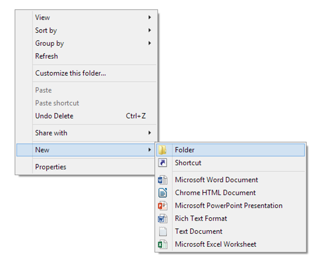
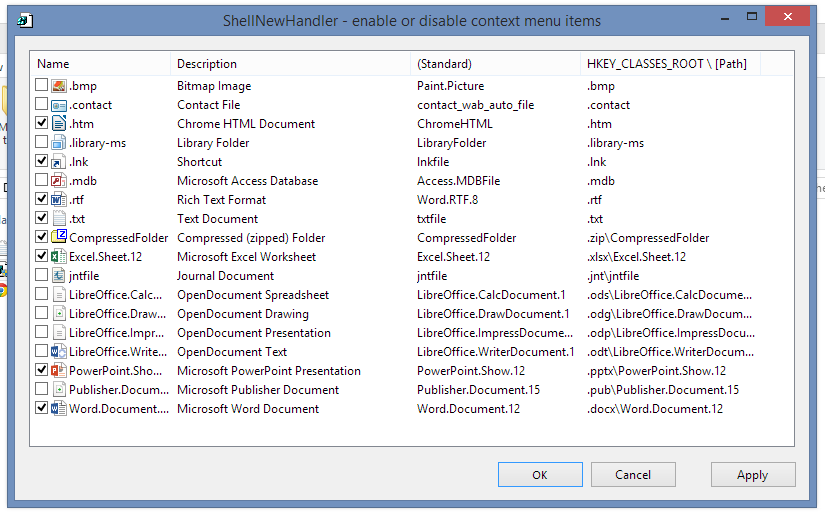
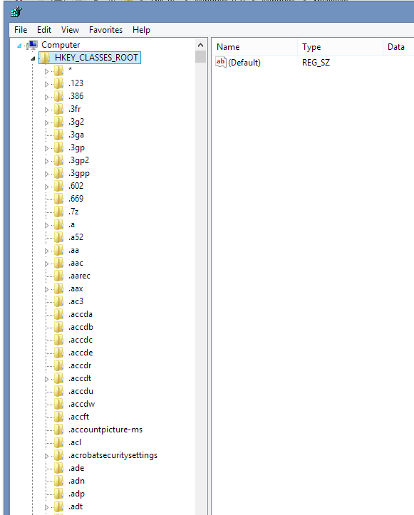
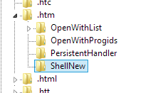
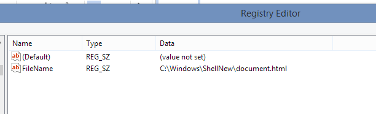

Right clicking within a folder of the Windows Explorer allows access to a convenient way to create new files through the context menu:

This post discusses a number of ways how this context menu can be changed.

### Edit Menu With Handy Tool

[ShellNewHandler](http://sourceforge.net/projects/shellnewhandler/) is a useful tool to 'clean up' the 'New' context menu. Just download and run the application and deselect the options you do not need:

### Edit Menu Through Windows Registry

Search for 'regedit' in the windows search and open the Registration Editor. The relevant entries for the 'New' context menu can be found under 'HKEY_CLASSES_ROOT'.

Specifically, the relevant information should be under the key '.\[filetype\]/ShellNew'.

Set various values within this key to control the behaviour of the New context menu.

- Adding a value with the name '**NullFile**' (and no value) will create a new empty file for the extension if it's selected from the new context menu.
- Adding a value '**FileName**' with a value of a path to a file will use the pointed to file as a template for creating new files.

### References

[Add file types and templates (Windows XP)](http://www.techrepublic.com/article/techrepublic-tutorial-add-file-types-to-windows-new-command-menu/)

[Reference for Registry Entries (Windows 95)](http://mc-computing.com/WinExplorer/WinExplorerRegistry_ShellNew.htm)

[ShellNewHandler: Useful open source tool to remove entries from the 'New' context menu](http://sourceforge.net/projects/shellnewhandler/)
