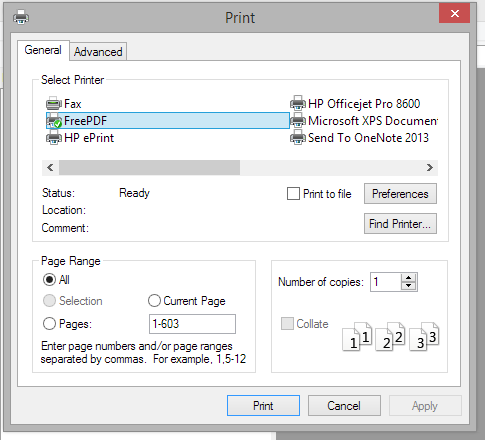
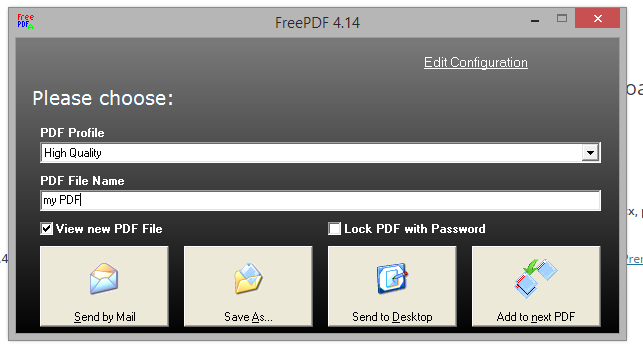

---
categories:
- productivity
coverImage: freepdf-print.png
date: "2015-01-26"
primaryBlog: maxrohde.com
tags:
- tools
title: Free PDF Printing for Windows without Adware
---

Printing from any windows application to a PDF printer is not supported in the most recent Windows versions by default.

Most free applications for this purpose which can be found through a simple Google search unfortunately often come with **unwanted Malware or Adware** (hello, Ask.com toolbar!).

However, there is a free and easy solution which comes bundled without any additional software:

**Ghostscript + The FreePDF printer**

Just download and install Ghostscript from here: [heise.de](http://www.heise.de/download/ghostscript-34a86be7f565a6034994a9c3fe1ded20-1422231827-26936.html).

Then, download the FreePDF printer from here: [freepdfxp.de/download_de.html](http://freepdfxp.de/download_de.html)

The website is in German, so I highlighted the download link in the image above.

Next time you print a document, the FreePDF printer should be available as one of the windows printers:

You then can choose whether to save the file or sent it by email (as well as choose the quality):

The FreePDF/GhostScript solution might not look shiny but it certainly does the job done (and leaves your system free of any unwanted guests).