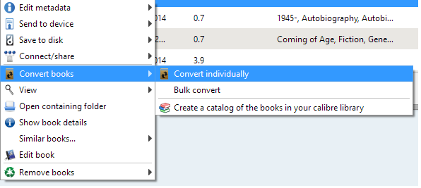

---
authors:
- max
blog: maxrohde.com
date: "2015-01-27"
tags:
- productivity
title: Rendering Beautiful PDF Documents with Calibre
---

The free software [Calibre](http://calibre-ebook.com/) allows to convert various ebook formats (such as EPUB and MOBI) into PDF documents.

Unfortunately, the default settings of Calibre do not result in the creation of easily readable documents.

Thus, I have provided here some sample settings for a nice looking PDF output for Calibre:

- First, import the book you would like to convert to Calibre. For this, just drag and drop the file from your file browser onto the Calibre screen.
- Right click the book and select the option Convert Books / Convert Individually

- Change the output to PDF on the top right corner of the screen
- Go the the page 'Page Setup' and change all margins to 75 pt.

- Go the the Page 'PDF Output' and set the following settings:

Now you can start the conversion. Right click the book after the conversion has completed and select 'Open containing folder' to access the converted PDF file.

**Troubleshooting**

- For some PDFs you have to set “Embed font family” under “Look & feel” for these instructions to work (Thanks, Nick!)
