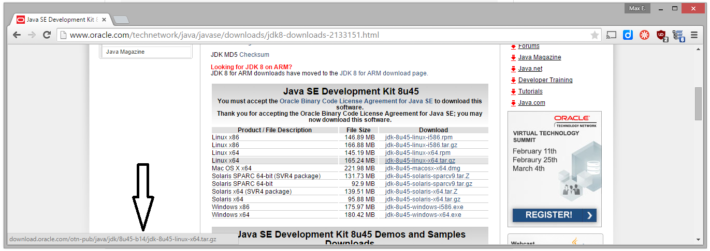

# Problem

You would like to install Oracle JDK using Puppet.

Using the [puppetlabs/java](https://forge.puppetlabs.com/puppetlabs/java) module, you might get an error message such as:

Error: Java distribution oracle-jdk is not supported. at \[…\]/init.pp:57 on node \[…\]

# Solution

Use the module [puppet-jdk-oracle](https://github.com/tylerwalts/puppet-jdk_oracle).

Just follow the [installation instruction](https://github.com/tylerwalts/puppet-jdk_oracle) from the GitHub page.

Note that you might want to set the java version used to the latest available. You can find the latest version and build number from the [Oracle JDK downloads](http://www.oracle.com/technetwork/java/javase/downloads/jdk8-downloads-2133151.html) page.

To get the build number, you first need to accept the terms and conditions and then check the URL of the link to download the version of the JDK you are interested in:

Also, make sure to configure the right platform: 'x64' for 64 bit systems and 'i586' for 32 bit systems.

**UPDATE:** Note that newer versions of Java 8 also require the inclusion of a hash. So the download link from Oracle will look as follows:

http://download.oracle.com/otn-pub/java/jdk/8u131-b11/**d54c1d3a095b4ff2b6607d096fa80163**/jdk-8u131-linux-x64.tar.gz

The part in bold is the hash.

As of 26th of Mai 2017, the configuration needs to be adjusted as follows (Thanks @Vulco, see in comments below):

Within ~/manifests/install.pp adjust the following variables:

$default\_8\_update = ‘131’ $default\_8\_build = ’11’ $default\_8\_hash = ‘d54c1d3a095b4ff2b6607d096fa80163’

As of 30th of April 2015, this would be the configuration for the latest JDK version on 64 bit Linux:

class { 'jdk\_oracle':

    version => '8',

    version\_update => '45',

    version\_build => '14',

    platform => 'x64',

    ensure => 'installed',

}
