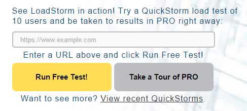
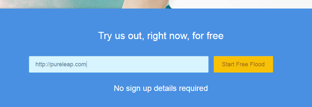

Good load testing of web and cloud applications should involve many concurrent connections originating from diverse networks. To set up such tests on your own is not trivial and probably very expensive. Thankfully, there are numerous service providers, which allow to use their infrastructure for testing your applications.

A few of these offer free online load tests. These fall into the two categories of free On Demand Tests which usually allow to test a website with 5 to 10 users and free tier accounts, which allow to use a certain number of concurrent users after sign up.

## On Demand Tests

The following providers allow to conduct quick on demand tests of websites.

### Loadstorm

[http://loadstorm.com/](http://loadstorm.com/)

### Flood.io

[https://flood.io/](https://flood.io/)

### Neustar

[https://www.neustar.biz/resources/tools/free-website-performance-test](https://www.neustar.biz/resources/tools/free-website-performance-test)

## Free Tier Accounts

Furthermore, there are a few services which allow to sign up for a free account, which allows to do some testing with their testing infrastructure:

### Blaze Meter

[http://blazemeter.com/pricing](http://blazemeter.com/pricing)

\=> Free Account with 50 concurrent users

### Loader.io

[https://loader.io/pricing](https://loader.io/pricing)

\=> Free Account with 10000 clients
