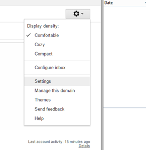
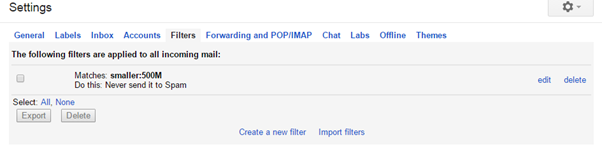
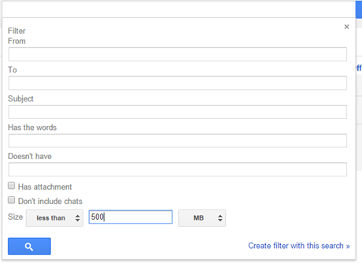
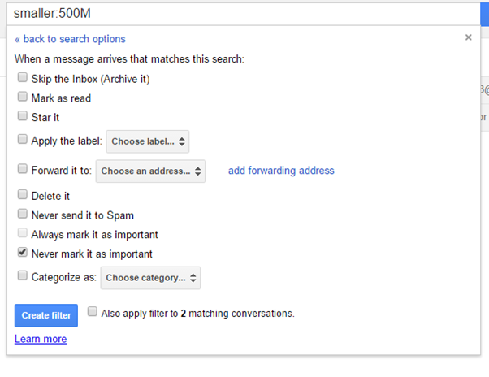

---
authors:
- max
blog: maxrohde.com
categories:
- productivity
date: "2015-06-18"
tags:
- productivity
title: Forward All Email from Gmail (even SPAM)
---

#### Problem

By default, Gmail does not forward email it considers spam even if it's configured to forward all email to a designated address.

#### Solution

You can make Gmail forward ALL emails by following these simple steps:

1. Go to settings:

1. Go to Filters and 'Create a new Filter'

1. Set Size less than 500 MB and 'Create Filter with this search'

1. Then select 'Never mark as spam' and \[Create Filter\]

Note: This will assure that messages marked as SPAM are forwarded. However, it will also result in all messages you sent being copied into your INBOX automatically. To prevent this, add a second filter:

5\. Create a new filter

6\. In the 'From' field put **Your Email address** and click 'create filter with this search'.

7\. Tick the option 'Skip the Inbox (Archive it) and click \[Create filter\]

All done; all your emails should be forwarded from now on.