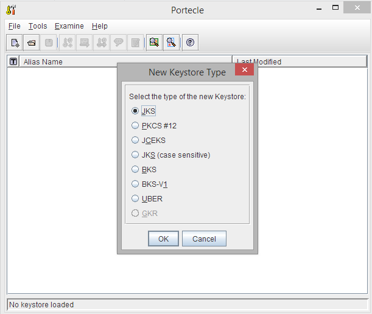
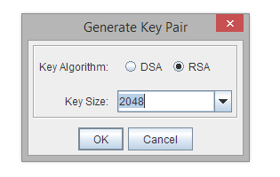
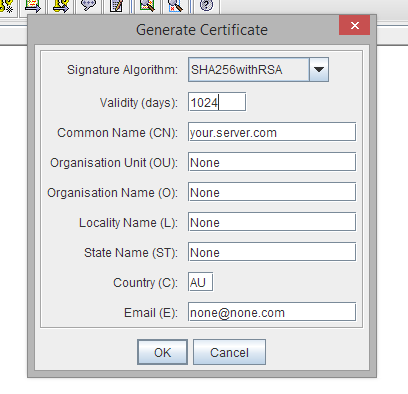
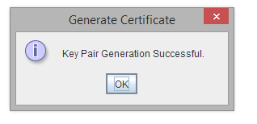
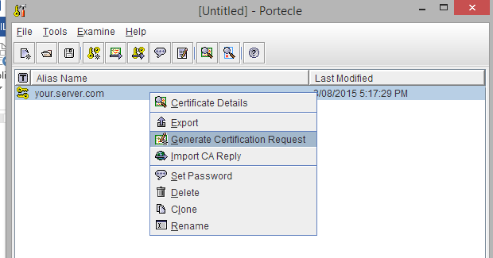
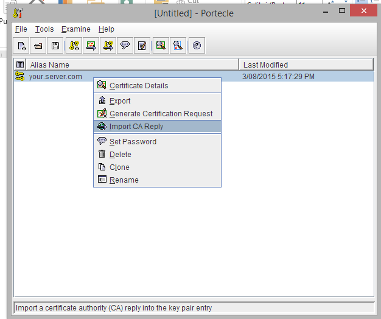
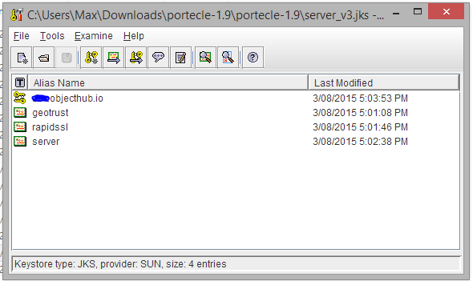

---
categories:
- java
date: "2015-08-03"
blog: maxrohde.com
tags:
- programming
- security
- ssl
title: Use Signed SSL Certificate with Java
---

It seems to me like every time I have to do something that has to do with SSL certificates – be they self-signed or signed by a certificate authority – things do not go smoothly. I only do this from time to time, so I am by no means an expert; but I do believe my difficulties result to some degree from the intrinsic complexities within SSL and the systems which support it.

I have created another guide which walks step by step through the process of configuring a Java key store with a signed SSL certificate. If you do want this to succeed, note that you have to follow every step precisely. Even minor omissions can lead to errors (believe me, I've tried it myself).

- Download [Portecle](http://portecle.sourceforge.net/) (from [here](http://sourceforge.net/projects/portecle/)) and Unzip it
- Start portecle.jar by double clicking it
- Go to File / New Keystore

- Select JKS and click \[OK\]
- Go to Tools / Generate Key Pair

- Select Algorithm RSA and Key size 2048
- Increase validity from the default 356 to 1000 or more days

- In Common Name provide the domain or subdomain of the domain you want to protect
- Provide some input for all other fields – do not leave any empty
- Provide a password and remember it (This can be the same password as for the the whole store)
- Provide an alias – best the name of your domain

- You should see the following:

- Right click the key pair you have create and select 'Generate Certification Request'

- Portecle will generate file 'XYZ**._csr_**' for you.
- Provide the contents of this file to the SSL provider of your choice (see a brief comparison [here](http://maxrohde.com/2014/11/05/ssl-certificate-comparison/) – I've had good experiences with RapidSSL certificates from GoGetSSL).
- Your SSL provider should supply you with an SSL certificate. This file should end with '**.crt**'. Download it.
- Go back to Portecle and right click your key pair again. Select 'Import CA Reply'.

- Import the .crt file you got from your SSL provider.
- If this does not work, first proceed to import the certificates as listed in the next steps, then try again to import the CA Reply.
- You can import the ROOT certificate of your SSL provider just in case.
- Also, your SSL provider will supply you with an intermediate and server certificate. You can import these into your keystore as well.
- Note that when importing the ROOT certificate of your provider, you might get a warning that no trust chain can be established to the certificate. However, when importing the intermediate and server certificates AFTER importing the root certificate, there should be no warning that no chain can be established.
- Your keystore should look something like this now:

- Now go to File / Save Keystore
- Provide the same password you used before.

Now you can use the created key store in Java servers. For an easy way how to use a keystore with Java, check out step 7 in [this post](http://maxrohde.com/2013/09/07/setting-up-ssl-with-netty/).