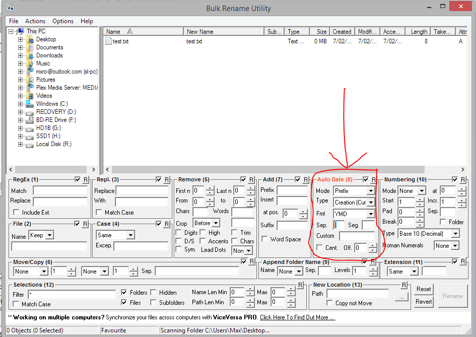

---
authors:
- max
blog: maxrohde.com
categories:
- productivity
date: "2016-02-07"
title: Add Date to File Name in Windows
---

I like to organize my files by prefixing the current date and time to the file name. Yes, sorting files by date created and date modified more or less accomplishes the same thing but I just find it to be more organized this way.

I've spent countless hours prefixing the respective date to files but today I found a much easier way.

I found the free tool [Bulk Rename Utility](http://www.bulkrenameutility.co.uk/Main_Intro.php).

Just download and extract this, then launch it and drag and drop the files you want to rename on the file list (it can be more than one file).

Then set the following options:

**Mode:** Prefix

**Type**: Creation (Current)

**Fmt**: YMD

**Sep.**: Just put one space

Next, select the file(s) you want to rename and click the Rename button on the bottom left.
