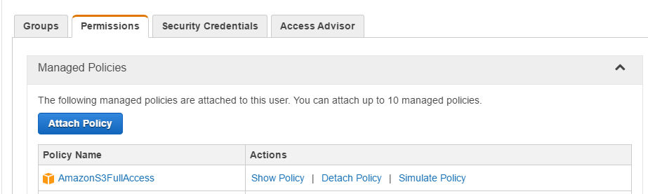
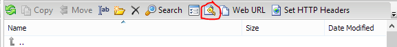
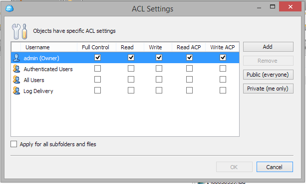

Using [bucket policies](http://docs.aws.amazon.com/AmazonS3/latest/dev/using-iam-policies.html), it is easy to set [ACL settings](http://docs.aws.amazon.com/AmazonS3/latest/dev/acl-overview.html) for all new objects that are uploaded to Amazon S3.

However, I wanted to remove 'public' read rights for a whole bunch of objects at the same time and such policies do not apply to objects that are already stored on S3.

I found an easy way to change the ACL settings for many objects at the same time. To bulk change, ACL, do the following:

- Download the free tool [CloudBerry Explorer for Amazon S3](http://www.cloudberrylab.com/free-amazon-s3-explorer-cloudfront-IAM.aspx)
- Install it
- In the AWS management console, go to Security Credentials
- Create a new user 's3-super'. Save the access and secret key.
- Assign the role  'AmazonS3FullAccess' to the user

- Start CloudBerry Explorer and connect to your S3 with the access and secret key of the s3-super user
- Now in this tool navigate to the bucket with the objects you would like to change
- Select one or more objects for which you want to change the ACL settings in the left-hand column.
- Click on the button ACL Settings

- In the dialog that pops up, change the settings to what you like and click OK.

The ACL settings for your objects should now be changed.
