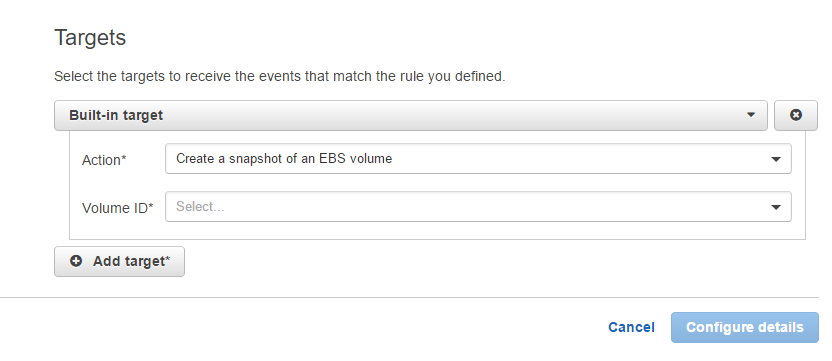

---
authors:
- max
blog: maxrohde.com
date: "2016-08-19"
tags:
- aws
- cloudwatch
- ec2
title: Automatically Make Snapshots for EC2
---

A quick Google search reveals that there are quite a few different approaches for automatically creating snapshots for EC2 images (such as [here](https://serverlesscode.com/post/lambda-schedule-ebs-snapshot-backups/), [here](https://www.flynsarmy.com/2015/06/how-to-schedule-daily-rolling-ebs-snapshots/) and [here](http://www.4synergy.nl/create-scheduled-snapshots-for-your-ec2-volumes/)).

All of these are rather difficult to do.

Thankfully, after some more searching around I found a great way to schedule regular snapshots using [AWS CloudWatch](https://aws.amazon.com/cloudwatch/).

CloudWatch supports a built-in target for 'Create a snapshot of an EBS volume':

For details of how this can be set up, see the [excellent step-by-step instructions on the CloudWatch Documentation](http://docs.aws.amazon.com/AmazonCloudWatch/latest/events/TakeScheduledSnapshot.html).