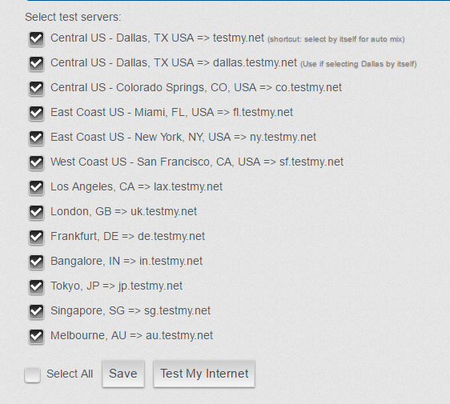
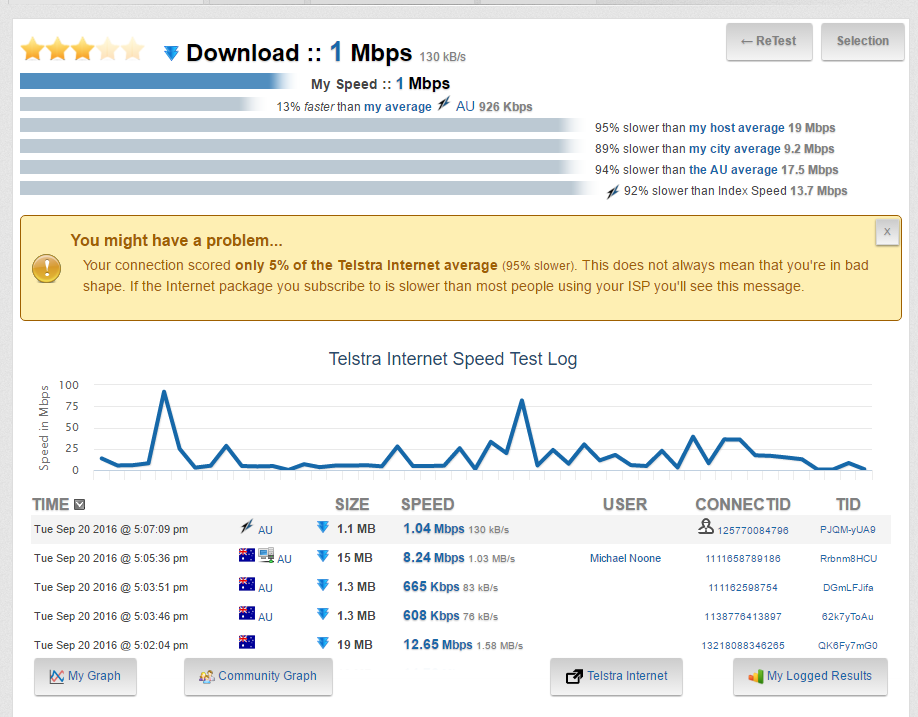

It's always a good idea to test the speed of your Internet connection after getting a new router of Internet provider. However, my Internet connection sometimes becomes **mysteriously slow**.

In that case, it is great to verify that is a problem with the Internet connection or maybe with the services you are using.

There are plenty of tools available for testing your Internet connection speed. Some of these are:

- [Speedtest.net](http://www.speedtest.net/)
- [SpeedOf.Me](http://speedof.me/)
- [FAST](https://fast.com/)

However, all of these are not very reliable, since they only test the connection of your computer to **one server**.

Now, the Internet is a [big and complex thing](http://internet-map.net/) and that you can download quickly from one server does not mean that you can download well from others.

Thankfully, there is the service [testmy.net](http://testmy.net/) which allows you to **test your connection to a whole bunch of servers at the same time**.

This can be done as follows:

- Open [testmy.net/multithread](http://testmy.net/multithread) in your browser
- Select all the servers from the list

- Click on the button **Test My Internet**

Note that sometimes there can be an error while you perform this. In that case, just run the test again.

You should soon receive an result as the following:

Don't be too worried when you are getting the message 'You might have a problem ...'. Usually, if you have a DSL connection anything around 1 Mbps and above should be fine.
