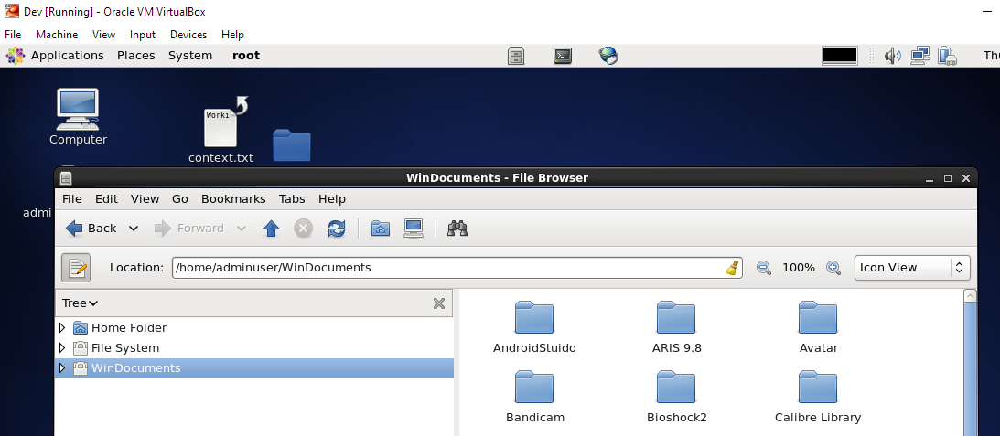

### Problem

You would like to share a folder between a VirtualBox **Linux Guest** and a **Windows Host**.

### Solution

- Start your VM
- Switch to Windowed Mode
- Select Devices / Shared Folders / Shared Folder Settings ...
- Create a New Folder on your Linux Guest. e.g.:
  - /home/\[Your User\]/WinDocuments
- Add a new Shared folder there, e.g.
  - Share Name WinDocuments
  - Windows Folder: C:\\Users\\\[Your User\]\\Documents
- Open a Terminal and run the following:

sudo mount -t vboxsf -o rw,uid=1000,gid=1000 Documents /home/\[Your User\]/WinDocuments

Now you should be able to copy files to and from Windows from your Linux host.

## **Permission Problems**

There are often tricky permission problems that prevent you from copying folders to Windows. You will get messages like 'Access denied' or 'Error while copying' or 'You do not have permissions for this operation'.

There are many ways to fix this, but the easiest is to start your the file browser of your Linux system with sudo or, if your Linux doesn't come with an UI, copy the files using sudo.

For instance, if you have the Nautilus file browser installed, run the following on the command line:

sudo nautilus

Then navigate to your shared folder and copy the files there.

Otherwise, copy files as follows:

sudo cp /local/file /home/\[Your User\]/WinDocuments

### Unmounting the Folder

When you are done working with the files, simply run the following from the command line:

sudo umount /home/\[Your User\]/WinDocuments

### References

- [Share Folders between Host and Guest OS in VirtualBox](http://helpdeskgeek.com/virtualization/virtualbox-share-folder-host-guest/)
- [File permission issues with shared folders under Virtual Box](http://unix.stackexchange.com/questions/52667/file-permission-issues-with-shared-folders-under-virtual-box-ubuntu-guest-wind)
- [File How to add VirtualBox shared folder in Windows Server 2008 as guest OSermission issues with shared folders under Virtual Box](https://expertester.wordpress.com/2009/10/06/how-to-add-virtualbox-shared-folder-in-windows-server-2008-as-guest-os/) (For Windows Guests)
- [VirtualBox Shared Folders with Ubuntu Server Guest](https://devtidbits.com/2010/03/11/virtualbox-shared-folders-with-ubuntu-server-guest/)
