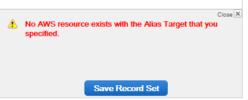
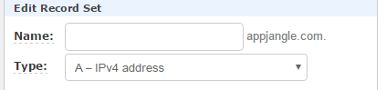

### Problem

You have create a CloudFront distribution with a custom domain name (such as yourdomain.com).

Now if you try to link this distribution to your domain using Route 53, you get the following error message:

\`No AWS resource exists with the Alias Target that you specified.\`

### Solution

Try the following to solve this problem:

- Make sure that the CNAME you specified for the CloudFront distribution matches your domain name **exactly**. For instance, if your domain name is www.yourdomain.com, make sure that this is also the CNAME.
- When creating the record set in Route 53, make sure to select the record type \`**A - IPv4 Address**\` and not CNAME.

