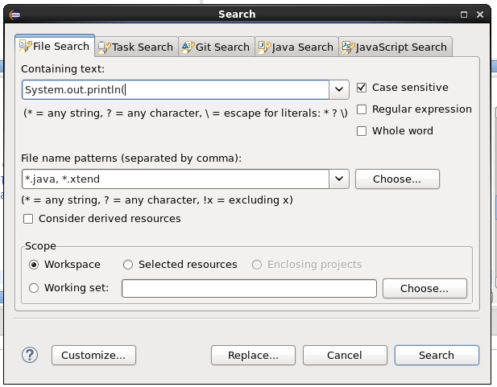
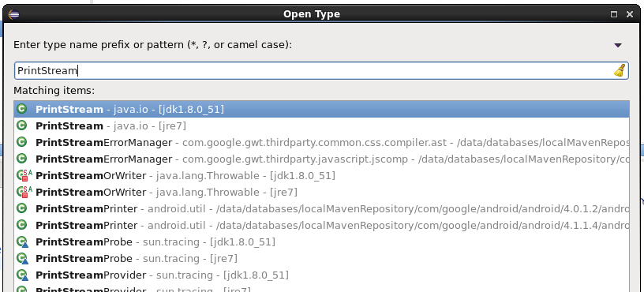
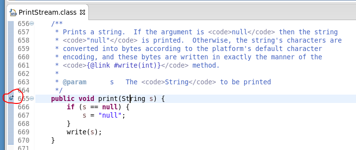

---
categories:
- java
date: "2016-12-16"
blog: maxrohde.com
tags:
- eclipse
- programming
title: 'Java: Find all instances of System.out.println()'
---

A good Java application should print only the absolute necessary to standard out. Not to do so can mean a serious hit in performance and can make it difficult to debug issues.

Unfortunately either we ourselves or our colleagues put System.out.println() statements in the code and then forget to remove them.

Here are two solutions how to find all those nasty statements.

### Solution 1: Do a Full Text Search

Use your IDE and search for all occurrences of the string "System.out.println()" in your code. In eclipse this can be done through **Menu / Search / File ...**

Make sure to use \*.java for the file name pattern.

### Solution 2: Put a Breakpoint in PrintStream

The above solution might not be practical if there are many System.out statements in the code which are legitimately there. In that case, you can also put a break point into the Java standard class **PrintStream**.

In eclipse, open the search for class dialog (Ctrl+Shift+t) and type in the class name PrintStream from the package java.io.

In this class, find the print(x) method and add a breakpoint:

Then run your program in debug mode. You can then find the places where System.out is called from the stack trace.