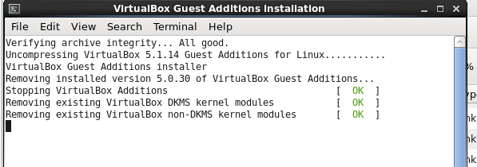

### Problem

For a CentOS based guest, the update of the VirtualBox Guest Additions hangs after the step: "Removing exiting VirtualBox non-DKMS kernel modules"

### Solutions

- Check the log file in /var/log/VBoxGuestAdditions-uninstall.log. See if there is anything obvious reported there you can fix.
- Check if your RAM disks are valid by running the command \`sudo lsinitrd\`.
  - If they are not, try rebuilding broken images with \`sudo dracut -f \[broken-image\].img \[kernel version\]\`
- Verify you have all [dependencies installed](https://wiki.centos.org/HowTos/Virtualization/VirtualBox/CentOSguest):
  - yum install dkms
  - yum groupinstall "Development Tools"
  - yum install kernel-devel
- Reinstall your Kernel image
  - List kernels \`rpm -qa kernel\`
  - [Reinstall kernel](https://ma.ttias.be/reinstall-the-linux-kernel-on-centos-or-rhel/)
- Verify that you have the [correct version](https://www.centos.org/forums/viewtopic.php?f=13&t=3811&p=251828&hilit=virtualbox#p251828) of kernel-devel installed
  - yum remove kernel-devel
  - yum install kernel-devel-\`uname -r\`
  - Restart system!
- Wait!
  - Let the installation run for a while, at least 15-20 min. It might do something!