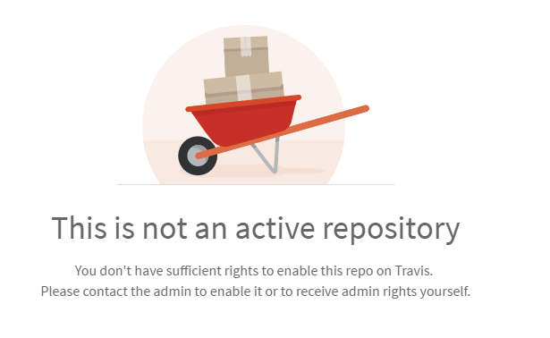

### Problem

Your repositories have been building just fine using the tool [Travis CI](https://travis-ci.org/) but suddenly the builds do not work anymore and the Travis CI website shows a screen with the message:

\`This is not an active repository\`

## Solution

- Go to [GitHub](https://github.com/) and assure that you are logged in with the account that owns the repository.
- Go to Travis CI and sign in with your GitHub account
- Go to the repository
- Click on the button 'Active Repository'

If all works, that's fine. However, if you get an error: 'There was an error while trying to activate the repository.' do the following:

- Go to the settings for your account on Travis - Assure that the repository you want to build is enabled.

## References

[Travis CI Issue #5629](https://github.com/travis-ci/travis-ci/issues/5629)

[StackOverflow \`Seeing “This is not an active repository” for an active repository\`](http://stackoverflow.com/questions/32022899/seeing-this-is-not-an-active-repository-for-an-active-repository)
