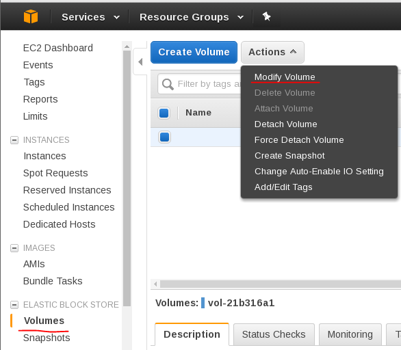
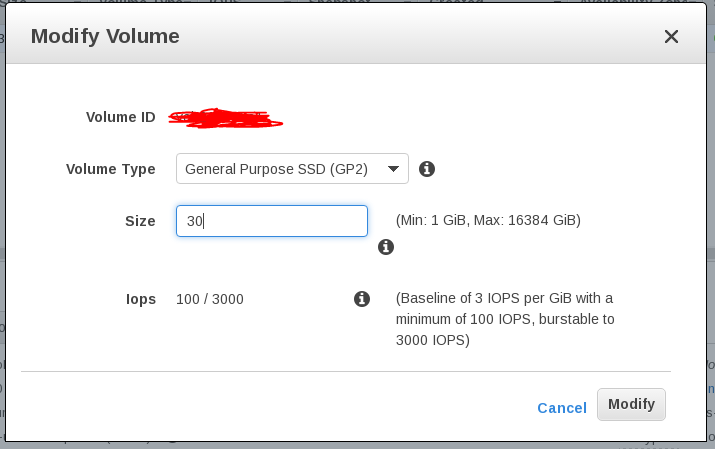
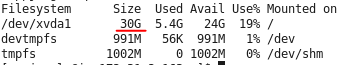

---
categories:
- linux
date: "2017-03-21"
primaryBlog: maxrohde.com
tags:
- aws
- devops
- ec2
- programming
title: Resize EC2 Volume (without Resizing Partition)
---

### Problem

You would like to resize a volume attached to an [EC2](https://aws.amazon.com/ec2/) instance.

### Solution

Do the following:

- Create a **snapshot** of your volume ([instructions](http://docs.aws.amazon.com/AWSEC2/latest/UserGuide/ebs-creating-snapshot.html))
- **Stop** your instance
- Go to EBS / Volumes and select **Actions / Modify Volume**

- Enter the new size for your volume (note you can only ever make the volume larger) and click on **Modify**

- Wait for the modification to be complete (this might take a while, like 30 min or so)
- **Start** your instance

Now, if everything went well, you should have more space available on the disk for the virtual machine. To confirm this, run:

df -h

You should see the new size of the volume as the size of your main partition:

### Notes

- If the size of your partition, does not match the size of the volume, you probably need to **resize your partition** ([instructions](http://docs.aws.amazon.com/AWSEC2/latest/UserGuide/storage_expand_partition.html)).
- Resizing the partition is a very painful process, that I think should best be avoided at all costs. I think for this it helps if the EC2 instance attached to the volume is **stopped** when the resize is performed. **Assure** that this is the case before you do the resize.
- If you forgot to stop your instance, and need to do a partition resize, there is a little workaround. Wait for six hours, then resize your volume again (this time while the instance is stopped). Then, it hopefully adjusts your partition size to the correct size.
- In the above, you might be able to start up your instance even while the new volume is still optimizing. I haven't tested this though but my guess is that it would work.