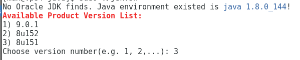

---
authors:
- max
blog: maxrohde.com
categories:
- java
- linux
date: "2017-11-07"
title: Install Latest JDK on Linux Server
---

**Edit**: Updated with new script version [provided by MaxdSre](https://axdlog.com/2018/setting-up-oracle-jdk-on-gnu-linux/).

To install the Oracle JDK on a Linus server is often a tricky proposition. For one, the download page requires to confirm a prompt and only unlocks the download link after this prompt has been confirmed (via a cookie, I think). This makes it difficult to download the binary in the first place!

Thankfully, MaxdSre has created the following handy script to download and extract the JDK:

[OracleSEJDK.sh](https://github.com/MaxdSre/axd-ShellScript/blob/master/assets/software/OracleSEJDK.sh)

If you run this script, you are presented with a prompt as follows:

Just select the version you require, and the script will download and install the Oracle JDK.

Finally, you might have existing JDK versions installed on your machine which are managed using alternatives. The updated version of the script should already trigger the alternatives command for you to configure which Java version to use.

For reference how to point your 'java' command to the new installation manually, please see [this article](https://tecadmin.net/install-java-8-on-centos-rhel-and-fedora/#).
