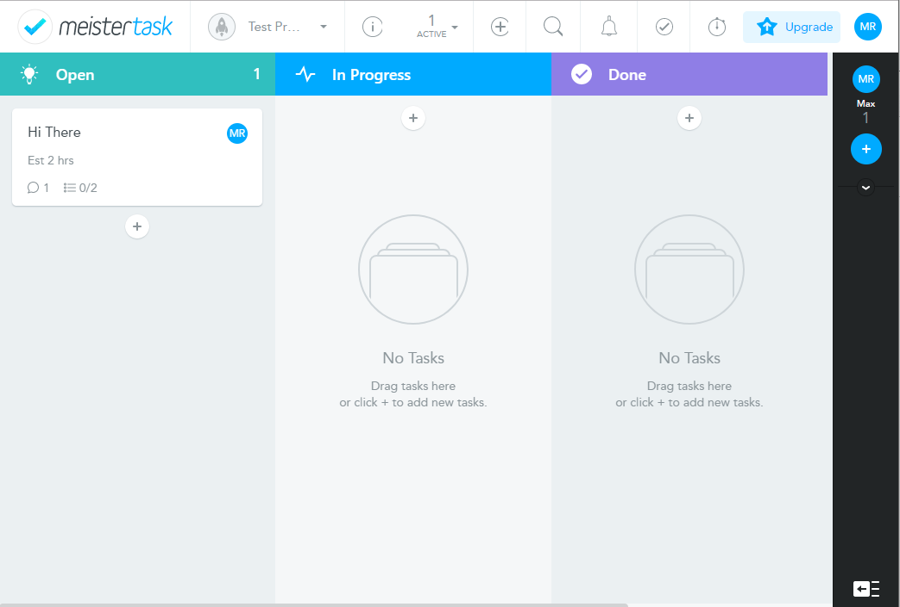

---
authors:
- max
blog: maxrohde.com
categories:
- productivity
date: "2017-12-27"
tags:
- productivity
- project-management
title: Task Management, Planning and Time Tracking
---

I've long been looking for a tool that allows me to **plan tasks**, **manage them** and **track time** for myself and for a small team. Unfortunately, I have not been very successful thus far to find a effective, robust and affordable solution for this.

The latest setup I am using is to use [Checkvist](https://checkvist.com/) for planning and managing tasks and [timetrack](http://timetrack.io/) for tracking time. However, unfortunately I found it becomes a bit cumbersome to plan and manage larger projects with Checkvist and there is no integration between Checkvist and timetrack.

Given these limitations with my current setup, I decided to once again look around for a new tool. Some of my key requirements are:

- Tracking time per project and task
- Being able to plan a large number of tasks. Specifically I often have to deal with a lot of 'optional' tasks, so tasks which might or might not have to be done.
- Being able to track the completion status of tasks
- Nice visualizations and dashboards to see how much time is spent on projects and tasks and how overall project completion is coming along.
- Cross-platform support, in particular an option to access the tool through a web interface.
- Ideally they offer a free plan or basic plan that allows creating unlimited projects and tasks
- Exporting tracked time and projects

With that in mind, I explored the options in the following. To make a long story short, the only solution I could find which satisfied my requirements was MeisterTask.

### MeisterTask

[MeisterTask](https://www.meistertask.com/) is a task management solution which integrates with the mind mapping solution [MindMeister](https://www.mindmeister.com/). I have always been fond of mind maps, so I was excited to investigate this solution further.

I was delighted to find out that meistertask comes with [Time Tracking](https://support.meistertask.com/hc/en-us/articles/202560731-Time-Tracking). This works very well.

For planning tasks, I like the feature that it is possible to define relationships between tasks, such as 'is blocked by'. If tasks, which block another task, are not completed, the blocked task is visually marked as being blocked:

Unfortunately, the free account of MindMeister is quite limited; it is only possible to create three mind maps or so. Also I found the feature to create tasks from mind map nodes not all that useful. However, I don't think MindMeister integration is necessary to work productively with MindMeister.

The biggest disadvantages of MindMeister as far as I can see is that the [Developer API is quite limited](https://developers.mindmeister.com/). For instance, I can't find ways to retrieve and write time tracking data.

### Asana

It seemed to me that [Asana](https://asana.com/) [does not support time tracking](https://community.asana.com/t/whats-the-best-time-tracking-application-in-asana/1457). I tried setting up time tracking with Hubstaff, which seemed quite promising to me. Unfortunately, after creating a new task on a project in Asana, there was a significant delay until that task was available in Hubstaff. I think it is quite critical to being able to create new tasks and report time into them straight away.

### Wrike

It looks like time tracking in [Wrike](https://www.wrike.com/) is only [available for Business accounts](https://help.wrike.com/hc/en-us/articles/209603089-Time-Tracking). These currently start at $24.80 pm which I think is a bit pricey.

### Avanza

Avanza does [not support unlimited number of projects](https://www.avaza.com/pricing) for their basic accounts.

### Trigger

[Too many limitations](https://www.triggerapp.com/pricing) on the free account for my liking!