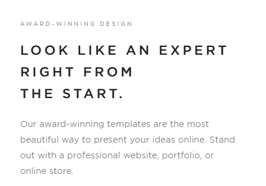
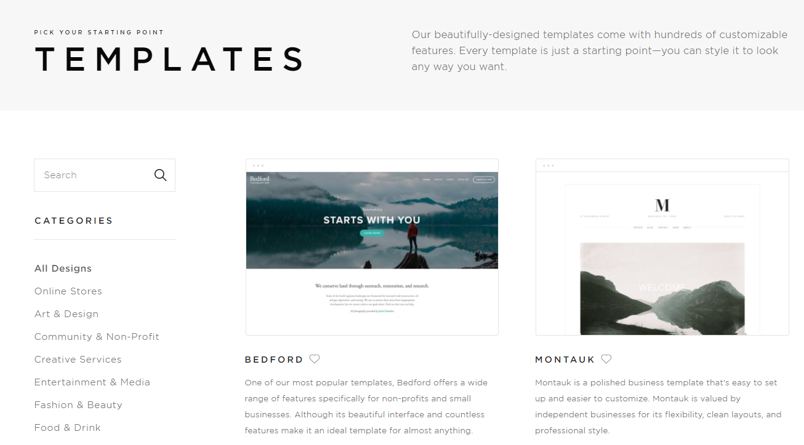

I want to start a new category of articles for this blog where I record web or user experience design I come across and which impresses me. I will start today with the homepage of [Squarespace](https://www.squarespace.com/). Since they are a web design company, good design can be expected of course. Some things which I noticed where the following:

### Nice Fonts

\[caption id="attachment_2488" align="alignnone" width="442"\] For headings, they use an all-caps, spaced out font: [Gotham](https://www.typography.com/fonts/gotham/overview/) with font size 22px, line height 1.6em and letter spacing of 0.2em. The body text is also Gotham with font size 14px and line height of 1.8em.\[/caption\]

### Simple but Effective Buttons

\[caption id="attachment_2489" align="alignnone" width="454"\] Buttons come either with a white background and black text or the other way around. The font size used is 11px.\[/caption\]

### Nice and Clean Gallery of Templates

### What I didn't Like

I think the lack of a main menu makes it quite difficult to find the things one is looking for. To find the gallery of templates, one needs to scroll all the way down to the bottom of the page and then select 'Websites'. Also the pricing information is not easily accessible.
