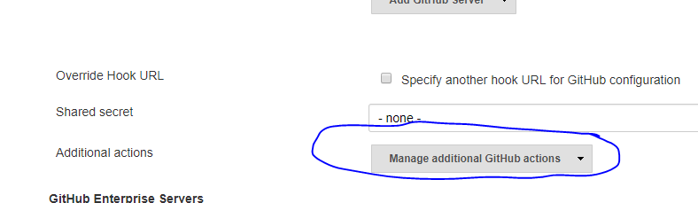
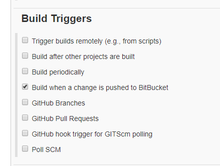

---
authors:
- max
blog: maxrohde.com
categories:
- java
date: "2018-01-05"
tags:
- devops
- jenkins
- linux
- programming
title: Installing Jenkins on Centos 7
---

I set up a Jenkins server on a brand new Centos 7 VPS. In the following the instructions for doing this in case you are looking at doing the same:

### Setting up Jenkins Server

- Install [OpenJDK Java](http://openjdk.java.net/install/)

sudo yum install java-1.8.0-openjdk

- Add [Jenkins Repo and install Jenkins](https://wiki.jenkins.io/display/JENKINS/Installing+Jenkins+on+Red+Hat+distributions)

sudo wget -O /etc/yum.repos.d/jenkins.repo http://pkg.jenkins-ci.org/redhat/jenkins.repo
sudo rpm --import https://jenkins-ci.org/redhat/jenkins-ci.org.key
sudo yum install jenkins

Or for stable version (link did not work for me when I tried it)

```
sudo wget -O /etc/yum.repos.d/jenkins.repo https://pkg.jenkins.io/redhat-stable/jenkins.repo
sudo rpm --import https://pkg.jenkins.io/redhat-stable/jenkins.io.key
yum install jenkins
```

- Start Jenkins server

sudo systemctl start jenkins

You should now be able to access Jenkins at yourserver.com:8080 (if not, see troubleshooting steps at the bottom).

If you want to access your server more securely on port 80, you can do so by installing ngnix as outlined in this article in step 4: [How to Install Jenkins on CentOS 7](https://www.vultr.com/docs/how-to-install-jenkins-on-centos-7).

### Connecting to a Git Repo

You will probably want to connect to a git repository next. This is also somewhat dependent on the operating system you use, so I provide the steps to do this on CentOS as well:

- Install git

sudo yum install git

- Generate an SSH key on the server

ssh-keygen -t rsa

- When prompted, save the SSH key under the following path (I got this idea from reading the comments [here](https://mohitgoyal.co/2017/02/27/configuring-ssh-authentication-between-github-and-jenkins/))

/var/lib/jenkins/.ssh

- Assure that the .ssh directory is owned by the Jenkins user:

sudo chown -R jenkins:jenkins /var/lib/jenkins/.ssh

- Copy the public generated key to your git server (or add it in the GitHub/BitBucket web interface)
- Assure your git server is listed in the known_hosts file. In my case, since I am using BitBucket my /var/lib/jenkins/.ssh/known_hosts file contains something like the following

bitbucket.org,104.192.143.3 ssh-rsa \[...\]

- You can now create a new project and use Git as the SCM. You don't need to provide any git credentials. Jenkins pulls these automatically form the /var/lib/jenkins/.ssh directory. There are good instructions for this available [here](https://www.thegeekstuff.com/2016/10/jenkins-git-setup/).

### Connecting to GitHub

- In the Jenkins web interface, click on **Credentials** and then select the Jenkins Global credentials. Add a credential for GitHub which includes your GitHub username and password.
- In the Jenkins web interface, click on **Manage Jenkins** and then on **Configure System**. Then scroll down to GitHub and then under GitHub servers click the Advanced Button. Then click the button Manage additional GitHub actions.



- In the popup select Convert login and password to token and follow the prompts. This will result in a new credential having been created. Save and reload the page.
- Now go back to the GitHub servers section and now click to add an additional server. As credential, select the credential which you have just selected.
- In the Jenkins web interface, click on **New Item** and then select GitHub organisation and connect it to your user account.

Any of your GitHub projects will be automatically added to Jenkins, if they contain a Jenkinsfile. [Here is an example](https://github.com/javadelight/delight-metrics-js/blob/master/Jenkinsfile).

### Connect with BitBucket

- First, you will need to install the [BitBucket plugin](https://wiki.jenkins.io/display/JENKINS/BitBucket+Plugin).
- After it is installed, create a normal git project.
- Go to the Configuration for this project and select the following option:



- Log into BitBucket and create a webhook in the settings for your project pointing to your Jenkins server as follows: http://youserver.com/bitbucket-hook/ (note the slash at the end)

### Testing a Java Project

Chances are high you would like to run tests against a Java project, in the following, some instructions to get that working:

- Install maven as described here: [How To Install Apache Maven on CentOS/RHEL 7/6 & Fedora](https://tecadmin.net/install-apache-maven-on-centos/#)
- Add Maven installation as described here: [Jenkins – Maven Setup](https://www.tutorialspoint.com/jenkins/jenkins_maven_setup.htm)

### Troubleshooting

- If you cannot open the Jenkins web ui, you most likely have a problem with your firewall. Temporarily disable your firewall with: \`sudo systemctl stop iptables\` and see if it works then.
- If it does, you might want to check your rules in \`/etc/sysconfig/iptables\` and assure that port 8080 is open
- Check the log file at:

sudo cat /var/log/jenkins/jenkins.log
