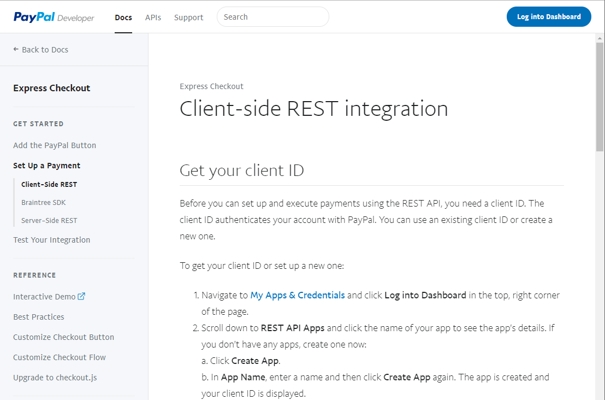
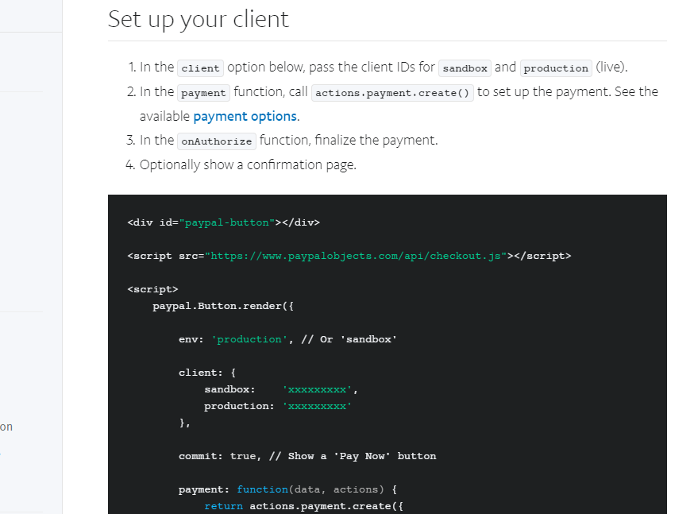
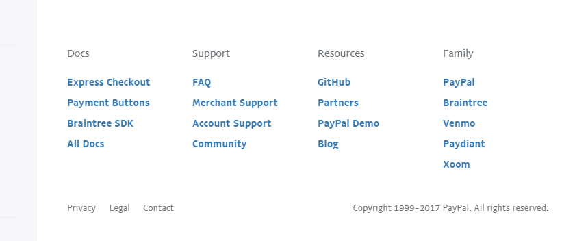

I find that developer documentation is often not very pleasant to look at and, more importantly, often very difficult to navigate. I worked briefly with the PayPal REST API and, while I found that at times it can be confusing to deal with the numerous APIs PayPal offers, aesthetically their [developer documentation](https://developer.paypal.com/docs/api/overview/) is clear and effective.

## What I Like

### Clear Overall Design

\[caption id="attachment_2511" align="alignnone" width="1108"\] Overall the documentation looks nice and clear. I like the fonts and colours used. The multi-level menu on the left fits in well and provides good means of navigation without feeling overwhelming.\[/caption\]

### Good Instructions and Code Examples

\[caption id="attachment_2512" align="alignnone" width="879"\] The subheadings are easy to spot and the step-by-step instructions weave code into them quite nicely. Code examples stand out due to the different background colour.\[/caption\]

### Clear and Informative Footer

\[caption id="attachment_2513" align="alignnone" width="821"\] The footer for the page fits nicely into the overall design and gives access to a wide range of resources.\[/caption\]
