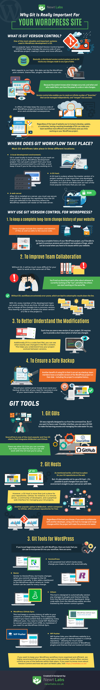

Some time ago, I have written an article about how to [set up versioning for WordPress using git](https://maxrohde.com/2017/11/12/versioning-wordpress-with-git-and-revisr/). I now came across an article by Newt Labs which have created an infographic about the [justification for using git for WordPress](https://newtlabs.co.uk/why-git-is-really-important-for-your-wordpress-site-infographic/). I think this infographic is quite insightful, so I will provide it below (with the kind permission of Newt Labs).

One thing which was of particular interest to me was that there was a handy list of alternatives to [Revisr](https://revisr.io/) in the graphic. The alternatives are the following:

- [VersionPress](https://versionpress.net/)
- [Gitium](https://github.com/PressLabs/gitium)
- [WordPress GitHub Sync](https://github.com/mAAdhaTTah/wordpress-github-sync)
- [WP Pusher](https://wppusher.com/)

Personally I have only used Revisr, which worked fine for me. However, I am a bit concerned by their website greeting visitors with a warning about an expired SSL certificate. This should really have been fixed by now and is not building my trust in the tool.

