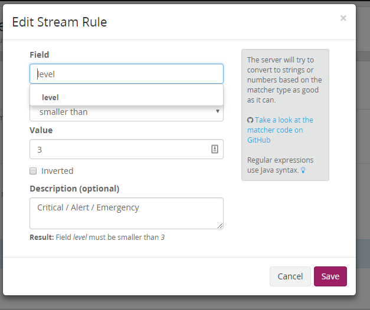

---
authors:
- max
blog: maxrohde.com
categories:
- linux
date: "2018-01-22"
tags:
- devops
- monitoring
- open-source
title: Setting Up Graylog Server
---

[I have been looking around for an easy to use and reasonable priced solution for managing logs](https://maxrohde.com/2017/12/29/free-cloud-based-log-and-metrics-management-solutions/) distributed among many servers and system metrics for these servers. I had a brief look into setting up an [ELK system](https://www.elastic.co/webinars/introduction-elk-stack) but I found that looked quite cumbersome. Recently I came across [Graylog](https://www.graylog.org/) and I found it looked quite promising. I thus set up a little sample system.

While the documentation for Graylog is generally quite good, I found it a bit difficult to piece together the various steps in setting up a minimal working system. Thus I have documented these steps below!

### Installing Graylog and Dependencies

Just follow the excellent [CentOS installation instructions](http://docs.graylog.org/en/2.4/pages/installation/os/centos.html) from the Graylog documetation.

Make sure to provide details for sending emails under the header _\# Email transport_.

If you are using a firewall, open ports 9000 for TCP and 51400 for UPD. For instance, by assuring the following lines are in _/etc/sysconfig/iptables_.

```


-A INPUT -p tcp -m state --state NEW -m tcp --dport 9000 -j ACCEPT
-A INPUT -p udp -m state --state NEW -m udp --dport 51400 -j ACCEPT

```

Don't forget to restart the iptables service: _sudo systemctl restart iptables_.

### Collecting the Logs from Another CentOS System

- Install rsyslog on the system

```


sudo yum install rsyslog

```

- Enable and start rsyslog service (also see [this guide](https://marketplace.graylog.org/addons/a47beb3b-0bd9-4792-a56a-33b27b567856))

```


sudo systemctl enable rsyslog

sudo systemctl start rsyslog

```

- Edit the file */etc/rsyslog.conf* and put the following line at the end, into the section marked as *\# ### begin forwarding rule ###* (replace yourserver.com with your graylog server address.

```


*.* @yourserver.com:51400;RSYSLOG_SyslogProtocol23Format

```

- Restart rsyslog

```


sudo systemctl restart rsyslog

```

The rsyslog log messages should now be getting send to your server. Give it a few minutes if you don't see the messages in graylog immediately. Otherwise, check the [system log for any errors](https://www.loggly.com/docs/troubleshooting-rsyslog/) (_sudo cat /var/log/messages_).

Also, you can test the connection by entering the following on the monitored system:

```


nc -u yourserver.com 51400
Hi

```

This should result in the message _Hi_ being received by graylog.

### Analysing Logs

The next steps are quite easy to to since they can be done in the excellent graylog user interface.

- [Configure your system as an input](http://docs.graylog.org/en/2.0/pages/getting_started/config_input.html). Use UDP and port 51400
- [Configure a stream](http://docs.graylog.org/en/2.4/pages/streams.html). Select your input and configure that it will contain only servere messages:



- [Create an alert](http://docs.graylog.org/en/2.4/pages/streams/alerts.html). Trigger it when there is 'more than 0' messages in the stream you have just created.

Done! You are now collecting logs from a server and you will receive an email notification whenever there is a serious issue reported on the server!
