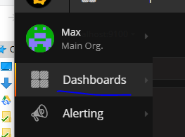
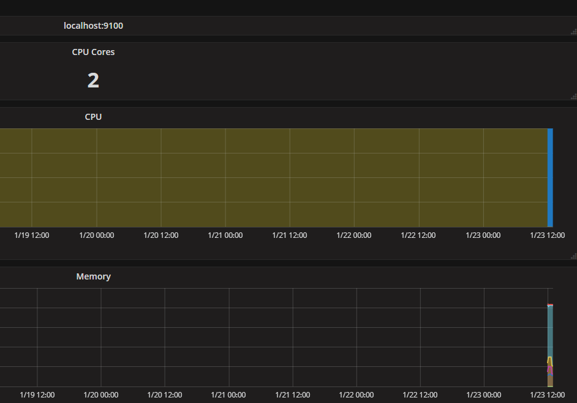
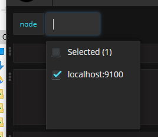
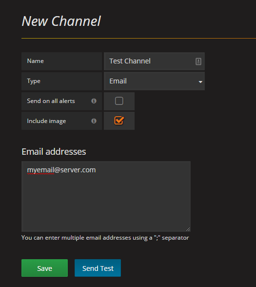
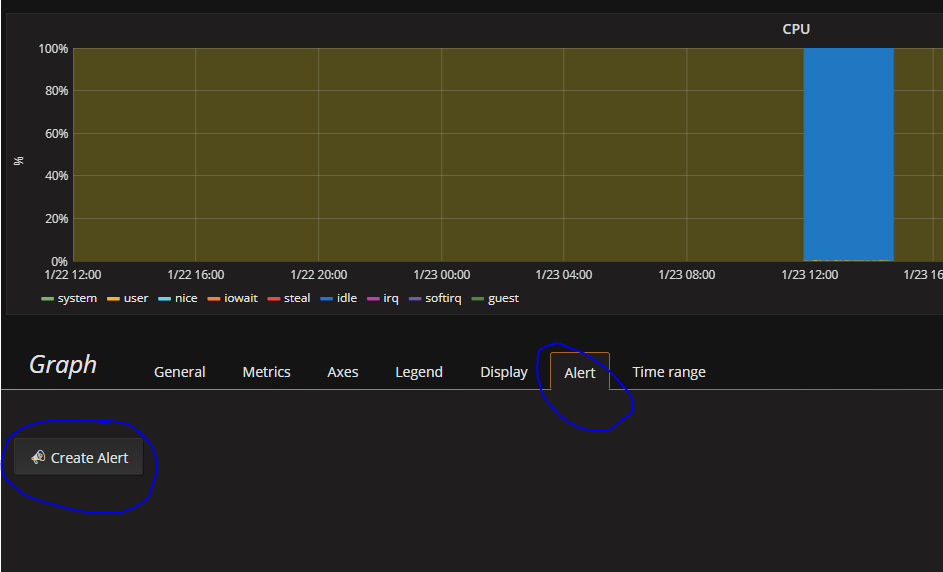
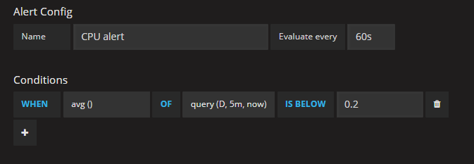

---
authors:
- max
blog: maxrohde.com
categories:
- linux
date: "2018-01-23"
tags:
- devops
- grafana
- metrics
- programming
- prometheus
title: Setting up Prometheus and Grafana for CentOS / RHEL 7 Monitoring
---

As mentioned in [my previous post](https://maxrohde.com/2018/01/23/setting-up-graylog-server/), I have long been looking for a centralised solution for collecting logs and monitoring metrics. I think my search was unsuccessful since I was looking for too many things in one solution. Instead I found now two separate solutions, one for log management ([using Graylog](https://maxrohde.com/2018/01/23/setting-up-graylog-server/)) and one for metrics (using [Prometheus](https://prometheus.io/) and [Grafana](https://grafana.com/)). I deployed both of these on very inexpensive VPS machines and so far I am very happy with them.

In this post, I provide some pointers how to set up the metrics solution based on Prometheus and Grafana. I assume you are using a RHEL / CentOS system as the server hosing Prometheus and Grafana and you are interested in the OS metrics for a CentOS system. This tutorial will guide you through setting up the Prometheus server, collecting metrics for it using [node_exporter](https://github.com/prometheus/node_exporter) and finally how to create dashboards and alerts using Grafana for the collected metrics.

### Installing Prometheus Server

- Follow the excellent instructions [here](https://www.enigma14.eu/martin/blog/2017/09/20/prometheus-installation-on-centos-7/) with the following modifications.
  - Make sure to download the latest version of Prometheus (the link can be obtained on the [Prometheus download](https://prometheus.io/download/) page, this guide works with version 2.1.0)
  - For the systemd service, use the following file:

```


[Unit]
Description=Prometheus Server
Documentation=https://prometheus.io/docs/introduction/overview/
After=network-online.target
[Service]
User=root
Restart=on-failure
ExecStart=/opt/prometheus/prometheus --config.file=/opt/prometheus/prometheus.yml
[Install]
WantedBy=multi-user.target

```

**Note**: This configuration will run the Prometheus server as root. In a production environment, it is highly recommended to run it as another user (e.g. 'prometheus')

- If you are using a firewall, add the following rule to */etc/sysconfig/iptables* and restart service _iptables_:

```


-A INPUT -p tcp -m state --state NEW -m tcp --dport 9090 -j ACCEPT

```

### Viewing a Metric

- Go to http://yourserver.com:9090
- Click on Graph
- Enter the expression *http_requests_total* and click **Execute**.

You should the data of http requests served by the Prometheus server itself. If you click on the tab graph, you can see the data as a graph.

### Installing Node Exporter on the Server to be Monitored

- On the Prometheus server, go to the directory /opt
- Download the [latest version of Node Exporter](https://prometheus.io/download/#node_exporter) with wget.
- Extract the archive

```

tar xvfz node_exporter-*.tar.gz
```

- Create link (replace 0.15.2 with the version you have downloaded)

```


ln -s node_exporter-0.15.2.linux-amd64 node_exporter

```

- Define a service for node_exporter in */etc/systemd/system/node_exporter.service*

(or if you are using init.d, please see [this article](http://maxrohde.com/2018/02/01/configuring-an-initd-service-for-node_exporter/)).

```


[Unit]
Description=Node Exporter

[Service]
User=root
ExecStart=/opt/node_exporter/node_exporter --no-collector.diskstats

[Install]
WantedBy=default.target

```

**Note**: This configuration will run the Grafana server as root. In a production environment, it is highly recommended to run it as another user (e.g. 'prometheus')

(The *\--no-collector.diskstats* is added above since diskstats often does not work in virtualized environments. If that is not an issue for you, be free to leave this argument out.)

- Enable and start service

```


systemctl daemon-reload
systemctl start node_exporter
systemctl enable node_exporter

```

- Tell Prometheus to scrape these metrics by adding the following to /opt/prometheus/prometheus.yml

```

 - job_name: "node"
static_configs:
- targets: ['localhost:9100']
```

Now if you got to yourserver.com:9090/graph you can for instance enter the expression *node_memory_MemFree* and see the free memory available on the server.

You can also install node_exporter on another server. Simply point the job definition then to this servers address; and of course remember to open port 9100 on the server.

### Installing Grafana

The default Prometheus interface is quite basic. Thankfully [Grafana](https://prometheus.io/docs/visualization/grafana/) offers excellent integration with Prometheus and will result in a much nicer UI.

You can easily [install Grafana on your own server](http://docs.grafana.org/installation/rpm/#on-centos-fedora-redhat) or [use a free cloud-based instance](https://grafana.com/get) (limited to one user and five dashboards).

To install Grafana locally:

- First follow [these instructions](http://docs.grafana.org/installation/rpm/#on-centos-fedora-redhat).
- Graphana by default runs on port 3000, so make sure you add the following firewall rule after you install it:

```


-A INPUT -p tcp -m state --state NEW -m tcp --dport 3000 -j ACCEPT

```

- In the file */etc/grafana/grafana.ini*, provide details for an SMTP connection which can be used for sending emails (section \[smtp\]).
- Also update the host name in the field _domain_ to the address at which your server can be reached on the internet.

### Configuring Grafana

- Go to yourserver.com:3000
- The default login is username 'admin' and password 'admin'. Create a new user with a good password and delete the admin user.
- First connect with your [Prometheus instance as a data source](https://prometheus.io/docs/visualization/grafana/#creating-a-prometheus-data-source).
- Then go to Dashboards and select import



- Import the dashboard [Node Exporter Server Metrics](https://grafana.com/dashboards/405) by providing the dashboard id 405

Done! You should now be able to see the metrics for your server such as CPU usage or free memory.



If you monitor multiple servers, you can switch between them by clicking next to the text 'node'.



Additional servers will appear here if you add them to the Prometheus configuration:

```

- job_name: "node"
 static_configs:
 - targets: ['localhost:9100', 'xxxxx']
```

### Configure Alerting

While Prometheus has some build in alerting facilities, alerting in Grafana is much easier to use. To set up altering for the dashboard you have created:

- Go to Alerting / Notification Channels
- Click on **New Channel**
- Provide a name for the channel and your email address and click **Save**.



- Next go to the dashboard you have created: Node Exporter Server Metrics
- Click on the first panel to select it


- Next click on **Edit** in the menu which is shown above the panel
- Go to the **Alert** tab and click on **C\*\***reate Alert\*\*



- Configure the following condition(for more details about this, please see [this page](http://docs.grafana.org/alerting/rules/)):



- Select the **Notification** page on the right
- In **Send to**, select the notification channel you have created earlier.
- Provide a message such as: CPU usage high.
- **Save** the dashboard (Ctrl+S)

Done! You should now receive notifications if the CPU usage on any of the servers monitored on this dashboard is too high.

### Further Reading

- [First steps in using Prometheus](https://prometheus.io/docs/introduction/first_steps/)
- [How to Use Prometheus to Monitor Your CentOS 7 Server](https://www.digitalocean.com/community/tutorials/how-to-use-prometheus-to-monitor-your-centos-7-server)
