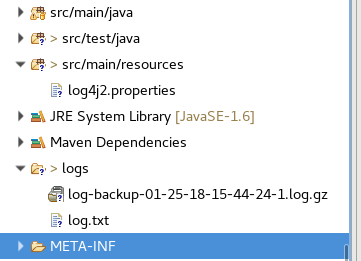
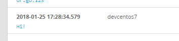

---
categories:
- java
date: "2018-01-25"
blog: maxrohde.com
tags:
- devops
- log4j
- logging
- tutorial
title: Java Logging - The Ultimate, Easy Guide
---

On first glance, logging looks like an exceedingly simple problem to solve. However, it is one of these problems which unfortunately become more and more complex the longer one looks at it.

I think because of this, there are many frameworks in Java to support logging (since everyone seems to have thought they have found a solution) with many of them being less than optimal, especially under load.

In effect, for someone who wants to start with logging in Java, there is an overwhelming, confusing and often contradictory wealth of resources available. In this guide, I will provide an introduction to Java logging in three simple steps: First, to choose the right framework. Second, to get your first log printed out onto the screen. And, third, to explore more advanced logging topics. So, without further ado, here the steps to get you started with Java logging:

### Framework

The first question to sort out when considering logging for Java is to decide which logging framework to use. Unfortunately, there are [quite a few to choose from](https://dzone.com/articles/java-logging-frameworks-and-tools).

The standard Java logging [seems to be very unpopular](https://blog.takipi.com/is-standard-java-logging-dead-log4j-vs-log4j2-vs-logback-vs-java-util-logging/). Further, it seems that Log4j and Logback both have architectural disadvantages to Log4j 2. In specific in respect to the performance impact which logging has on the host app. [Loggly ran some tests on the different logging frameworks](https://www.loggly.com/blog/benchmarking-java-logging-frameworks/) and the theoretical advantages of Log4j 2 also seem to be reflected in cold, hard data.

Thus, I think the prudent choice is to go with **log4j2** in any but exceptional circumstances.

### How To Get Started

The official documentation for Log4j 2 is not very approachable. Simply speaking, you only need to do two things to get ready for logging with Log4j 2.

The first is to add the following Maven dependency:

```

<dependency>
<groupId>org.apache.logging.log4j</groupId>
<artifactId>log4j-api</artifactId>
<version>2.10.0</version>
</dependency>
<dependency>
<groupId>org.apache.logging.log4j</groupId>
<artifactId>log4j-core</artifactId>
<version>2.10.0</version>
</dependency>
```

The second is to create the file src/main/resources/log4j2.properties in your project with the following content:

```

status = error
name = PropertiesConfig

filters = threshold

filter.threshold.type = ThresholdFilter
filter.threshold.level = debug

appenders = console

appender.console.type = Console
appender.console.name = STDOUT
appender.console.layout.type = PatternLayout
appender.console.layout.pattern = %d{yyyy-MM-dd HH:mm:ss} %-5p %c{1}:%L - %m%n

rootLogger.level = debug
rootLogger.appenderRefs = stdout
rootLogger.appenderRef.stdout.ref = STDOUT
```

(Note, you may also provide the configuration in XML format. In that case, simply create file named log4j2.xml in src/main/resources)

Now you are ready to start logging!

```

import org.apache.logging.log4j.LogManager;
import org.apache.logging.log4j.LogManager;
import org.apache.logging.log4j.Logger;

public class OutputLog {
  public static void main(String[] args) {
    Logger logger = LogManager.getLogger();
    logger.error("Hi!");
  }
}
```

### Master Class

The real power of using a logging framework is realised by modifying the properties file created earlier.

You can, for instance, configure it to log into a file and rotate this log file automatically (so it doesn't just keep on growing and growing). The following presents a properties file to enable this:

```


status = error
name = PropertiesConfig

property.filename = ./logs/log.txt

filters = threshold

filter.threshold.type = ThresholdFilter
filter.threshold.level = debug

appenders = rolling

appender.rolling.type = RollingFile
appender.rolling.name = RollingFile
appender.rolling.fileName = ${filename}
appender.rolling.filePattern = ./logs/log-backup-%d{MM-dd-yy-HH-mm-ss}-%i.log.gz
appender.rolling.layout.type = PatternLayout
appender.rolling.layout.pattern = %d{yyyy-MM-dd HH:mm:ss} %-5p %c{1}:%L - %m%n
appender.rolling.policies.type = Policies
appender.rolling.policies.time.type = TimeBasedTriggeringPolicy
appender.rolling.policies.time.interval = 1
appender.rolling.policies.time.modulate = true
appender.rolling.policies.size.type = SizeBasedTriggeringPolicy
appender.rolling.policies.size.size=10MB
appender.rolling.strategy.type = DefaultRolloverStrategy
appender.rolling.strategy.max = 20

loggers = rolling

logger.rolling.name = file
logger.rolling.level = debug
logger.rolling.additivity = false
logger.rolling.appenderRef.rolling.ref = RollingFile

#rootLogger.level = debug
#rootLogger.appenderRefs = stdout
rootLogger.appenderRef.stdout.ref = RollingFile

```

This configuration will result in a log file being written into the logs/ folder. If the application is run multiple times, previous log files will be packed into gzipped files:



For even more sophisticated logging, you would want to set up a [Graylog server](http://maxrohde.com/2018/01/23/setting-up-graylog-server/) and then send the logs there. This can be achieved using the [logstash-gelf](https://github.com/mp911de/logstash-gelf) library. Add the following Maven dependency:

```

<dependency>
<groupId>biz.paluch.logging</groupId>
<artifactId>logstash-gelf</artifactId>
<version>1.11.1</version>
</dependency>
```

And then provide a log4j.xml configuration file like the following (replace yourserver.com with your Graylog server):

```


<Configuration>
<Appenders>
<Gelf name="gelf" host="udp:yourserver.com" port="51401" version="1.1" extractStackTrace="true"
filterStackTrace="true" mdcProfiling="true" includeFullMdc="true" maximumMessageSize="8192"
ignoreExceptions="true">
<Field name="timestamp" pattern="%d{dd MMM yyyy HH:mm:ss,SSS}" />
<Field name="level" pattern="%level" />
<Field name="simpleClassName" pattern="%C{1}" />
<Field name="className" pattern="%C" />
<Field name="server" pattern="%host" />
<Field name="server.fqdn" pattern="%host{fqdn}" />

<DynamicMdcFields regex="mdc.*" />
<DynamicMdcFields regex="(mdc|MDC)fields" />
</Gelf>
</Appenders>
<Loggers>
<Root level="INFO">
<AppenderRef ref="gelf" />
</Root>
</Loggers>
</Configuration>

```

Then create a new GELF UDP input in Graylog (& don't forget to open the firewall for udp port 51401) and you are ready to receive messages!



Finally, I personally find the logging frameworks with all their dependencies and insistence on configuration files exactly where they expected them a bit intrusive. Thus, I developed [delight-simple-log](https://github.com/javadelight/delight-simple-log) - this very simply project can be used as a dependency in your reusable component; and then linked with Log4j 2 in the main package for an app. That way, the Log4j dependencies will only be present in one of your modules.